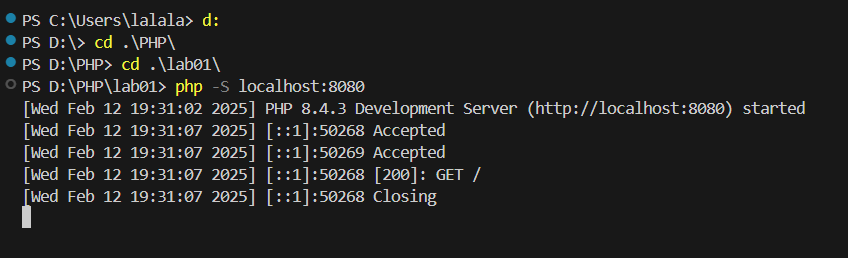
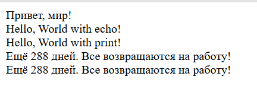

# Лабораторная работа №1: Установка и первая программа на PHP

## Автор
Mihailov Piotr I2302

## Цель работы
Целью данной лабораторной работы является установка и настройка среды разработки для работы с языком программирования PHP, а также создание первой программы на PHP.

## Выполнение работы

### Шаг 1: Установка PHP вручную
1. Скачал PHP и распаковал в `C:\Program Files\php`.
2. Добавил путь к PHP в системные переменные `Path`.
3. Проверил установку командой `php -v`.

### Шаг 2: Установка через XAMPP
Есть и альтернативный метод установки PHP, через XAMPP. Данный метод мы рассматривали на паре, но для моего удобства я выбрал первый вариант.

### Шаг 3: Первая программа на PHP
1. Создал папку проекта `D:\PHP\lab01`.
2. Создал файл `index.php` и добавил код:
   ```php
   <?php
   echo "Привет, мир!";
   ?>
   ```
3. Запустил сервер командой `php -S localhost:8000`.


### Шаг 4: Вывод данных в PHP
Пример кода для вывода данных:
```php
<?php
echo "Hello, World with echo!<br>";
print "Hello, World with print!<br>";
?>
```

### Шаг 5: Работа с переменными
Создал переменные и вывел их разными способами:
```php
<?php
$days = 288;
$message = "Все возвращаются на работу!";

echo "Осталось " . $days . " дней. " . $message . "<br>";
echo "Осталось $days дней. $message<br>";
echo "Осталось $days дней.<br>$message";
?>
```
## Вывод программы
```
Привет, мир!
Hello, World with echo!
Hello, World with print!
Ещё 288 дней. Все возвращаются на работу!
Ещё 288 дней. Все возвращаются на работу!
```



## Контрольные вопросы
1. **Какие способы установки PHP существуют?**
   - Ручная установка с официального сайта PHP.
   - Установка через XAMPP.
   

2. **Как проверить, что PHP установлен?**
   - Выполнить команду `php -v`.
   - Запустить  `phpinfo();` в браузере.

3. **Чем отличается `echo` от `print`?**
   - `echo` быстрее, так как не возвращает значение.
   - `print` возвращает `1`, поэтому может использоваться в выражениях.
   ## Библиография
1. Документация PHP: https://www.php.net/docs.php
2. Руководство по установке PHP: https://www.php.net/manual/ru/install.php
3. Официальный сайт XAMPP: https://www.apachefriends.org
4. Основы PHP: https://www.w3schools.com/php/
5. Переменные и вывод в PHP: https://www.php.net/manual/ru/language.variables.php
