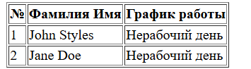
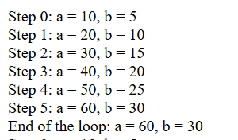

# Лабораторная работа №2: Управляющие конструкции

- Mihailov Piotr I2302

## Цель работы
Освоить использование условных конструкций и циклов в PHP.

---

## Задание 1: Условные конструкции

### Используя функцию date(), создать таблицу с расписанием, формируемым на основе текущего дня недели.

- **Для John Styles:**
  - Если текущий день недели — понедельник, среда или пятница, выведите график работы 8:00-12:00.
  - В остальные дни недели выведите текст: Нерабочий день.

- **Для Jane Doe:**
  - Если текущий день недели — вторник, четверг или суббота, выведите график работы 12:00-16:00.
  - В остальные дни недели выведите текст: Нерабочий день.

### Реализация

```php
<?php
$dayOfWeek = date('N');

if ($dayOfWeek == 1 || $dayOfWeek == 3 || $dayOfWeek == 5) {
    $johnSchedule = "8:00-12:00";
} else {
    $johnSchedule = "Нерабочий день";
}

if ($dayOfWeek == 2 || $dayOfWeek == 4 || $dayOfWeek == 6) {
    $janeSchedule = "12:00-16:00";
} else {
    $janeSchedule = "Нерабочий день";
}
?>
```

### Объяснение

- Функция date('N') возвращает номер дня недели (1 — понедельник, 7 — воскресенье).
- Условия if-else определяют график работы для каждого сотрудника.
- На текущую дату (02.03.2025 — воскресенье, $dayOfWeek = 7) оба сотрудника имеют Нерабочий день.


### Задание 2: Циклы

- Необходимо создать цикл с переменными `$a` и `b`, увеличивая `$a` на 10 и `b` на 5 на каждом шаге (от 0 до 5). Вывести промежуточные и конечные значения для:

1. Цикла for
2. Цикла while
3. Цикла do-while

### Реализация

- Цикл for

```php
<?php
$a = 0;
$b = 0;

for ($i = 0; $i <= 5; $i++) {
   $a += 10;
   $b += 5;
   echo "Step $i: a = $a, b = $b<br>";
}

echo "End of the loop: a = $a, b = $b";
?>
```

- Цикл while

```php
<?php
$a = 0;
$b = 0;
$i = 0;

while ($i <= 5) {
   $a += 10;
   $b += 5;
   echo "Step $i: a = $a, b = $b<br>";
   $i++;
}

echo "End of the loop: a = $a, b = $b";
?>
```

Цикл do-while

```php
<?php
$a = 0;
$b = 0;
$i = 0;

do {
   $a += 10;
   $b += 5;
   echo "Step $i: a = $a, b = $b<br>";
   $i++;
} while ($i <= 5);

echo "End of the loop: a = $a, b = $b";
?>
```

### Результат выполнения

- После выполнения всех циклов, выводится один и тот же результат


### Контрольные вопросы

**1. В чем разница между циклами for, while и do-while? В каких случаях лучше использовать каждый из них?**

- for: Используется, когда известно количество итераций. Инициализация, условие и шаг объединены в одной строке. Пример: перебор массива или фиксированное число повторений.
- while: Проверяет условие перед выполнением тела цикла. Используется, когда количество итераций заранее неизвестно. Пример: чтение данных до определенного условия.
- do-while: Выполняет тело цикла хотя бы раз, проверяя условие после. Используется, когда нужно гарантировать хотя бы одно выполнение. Пример: запрос ввода до корректного значения.

**2. Как работает тернарный оператор ? : в PHP?**

Тернарный оператор в PHP — это сокращенная форма записи условного оператора `if`. Он имеет следующий синтаксис:

`$условие ? $значение_если_истина : $значение_если_ложь;`

**3. Что произойдет, если в do-while поставить условие, которое изначально ложно?**

Если в цикле `do-while` условие ложно, то тело цикла выполнится один раз, а затем цикл завершится

## Библиография

- [Repository by N.Nartea](https://github.com/MSU-Courses/advanced-web-programming)
- [Официальная документация PHP](https://www.php.net/)

## Вывод

В ходе работы освоены условные конструкции и циклы в PHP. Реализованы задачи по созданию расписания на основе текущего дня недели с использованием функции `date()` и демонстрации работы циклов `for`, `while` и `do-while` с выводом промежуточных значений. Контрольные вопросы помогли закрепить теоретические знания об управляющих конструкциях и их применении
