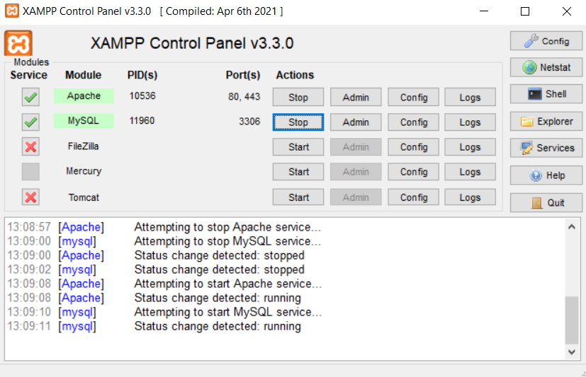
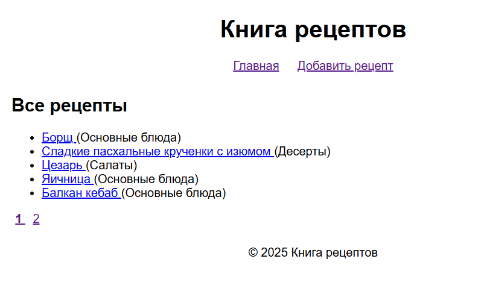
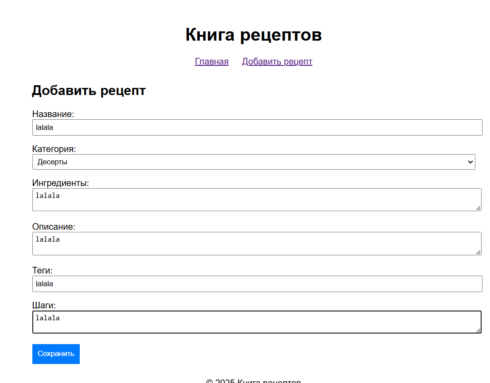
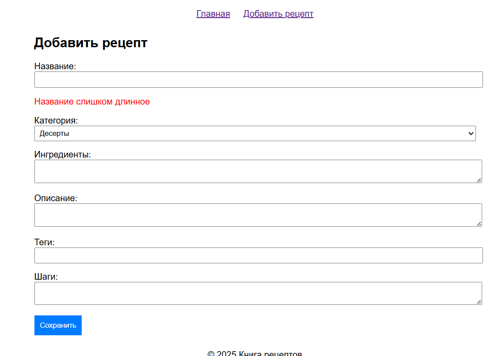
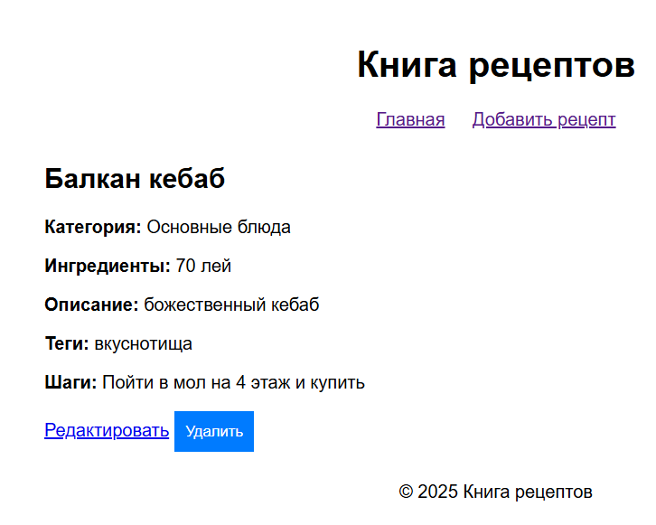

# Лабораторная работа №5. Работа с базой данных

## Выполнил

- Mihailov Piotr I2302
- Дата выполнения: 20.04.25

## Цель работы

Освоить архитектуру веб-приложения с единой точкой входа, подключение шаблонов для визуализации страниц и переход от хранения данных в файлах к использованию реляционной базы данных MySQL. В рамках проекта "Книга рецептов" реализовать CRUD-функциональность, пагинацию и защиту от SQL-инъекций.

## Условия

Продолжить разработку проекта, начатого в предыдущей лабораторной работе, с выполнением следующих задач:

- Реализовать архитектуру с единой точкой входа через файл `public/index.php`, обрабатывающий все входящие HTTP-запросы.
- Настроить систему шаблонов с использованием базового шаблона `templates/layout.php` и отдельных представлений для разных страниц.
- Перенести логику работы с рецептами из файловой системы в базу данных MySQL.
- Реализовать пагинацию с использованием SQL-запросов `LIMIT` и `OFFSET`, отображая по 5 рецептов на странице.
- Обеспечить защиту от SQL-инъекций с использованием подготовленных выражений PDO.
- Задокументировать код с использованием PHPDoc.

### XAMPP

Для локальной разработки был использован XAMPP. Для дальнейшей работы были включены `Apache` и `MySQL`



## Ход работы

### Задание 1. Подготовка среды

#### Создана база данных `recipe_book` со следующими таблицами

База данных создана через phpMyAdmin с использованием следующего SQL-кода:

```sql
CREATE DATABASE recipe_book CHARACTER SET utf8mb4 COLLATE utf8mb4_unicode_ci;
```

#### Таблица `categories`

```sql
CREATE TABLE categories (
    id INT AUTO_INCREMENT PRIMARY KEY,
    name VARCHAR(100) NOT NULL UNIQUE,
    created_at TIMESTAMP DEFAULT CURRENT_TIMESTAMP
);
```

**Объяснение**:

- Таблица хранит категории рецептов (например, "Десерты", "Салаты").
- `id`: Первичный ключ с автоинкрементом.
- `name`: Уникальное название категории.
- `created_at`: Временная метка создания записи.

#### Таблица `recipes`

```sql
CREATE TABLE recipes (
    id INT AUTO_INCREMENT PRIMARY KEY,
    title VARCHAR(255) NOT NULL,
    category INT NOT NULL,
    ingredients TEXT,
    description TEXT,
    tags TEXT,
    steps TEXT,
    created_at TIMESTAMP DEFAULT CURRENT_TIMESTAMP,
    FOREIGN KEY (category) REFERENCES categories(id) ON DELETE CASCADE
);
```

**Объяснение**:

- Таблица хранит данные о рецептах.
- `id`: Первичный ключ с автоинкрементом.
- `title`: Название рецепта (обязательное, до 255 символов).
- `category`: Внешний ключ, ссылающийся на `categories(id)`.
- `ingredients`, `description`, `tags`, `steps`: Текстовые поля для хранения списка ингредиентов, описания, тегов и шагов приготовления.
- `created_at`: Временная метка создания.
- `FOREIGN KEY ... ON DELETE CASCADE`: При удалении категории автоматически удаляются связанные рецепты.

#### Тестовые данные

Для тестирования функциональности добавлены следующие данные:

```sql
INSERT INTO categories (name) VALUES ('Десерты'), ('Основные блюда'), ('Салаты');
INSERT INTO recipes (title, category, ingredients, description, tags, steps) VALUES
('Шоколадный торт', 1, 'Мука, сахар, какао, яйца', 'Вкусный торт', 'десерт, шоколад', '1. Смешать ингредиенты\n2. Выпекать 30 мин'),
('Салат Цезарь', 3, 'Салат, курица, соус', 'Классический салат', 'салат, курица', '1. Нарезать ингредиенты\n2. Смешать с соусом');
```

### Задание 2. Архитектура и шаблонизация

#### Структура проекта

```struct
recipe-book/
├── config/
│   └── db.php                     # Параметры подключения к базе данных
├── public/
│   ├── index.php                  # Единая точка входа и маршрутизация
│   ├── .htaccess                  # Перенаправление запросов на index.php
│   └── assets/
│       └── style.css              # Стили для интерфейса
├── src/
│   ├── db.php                     # Функция подключения к базе данных
│   ├── helpers.php                # Вспомогательные функции
│   ├── models/
│   │   ├── Recipe.php             # Модель для работы с рецептами
│   │   └── Category.php           # Модель для работы с категориями
│   └── controllers/
│       └── RecipeController.php   # Контроллер для обработки запросов
├── templates/
│   ├── layout.php                 # Базовый шаблон
│   ├── index.php                  # Список рецептов с пагинацией
│   └── recipe/
│       ├── create.php             # Форма добавления рецепта
│       ├── edit.php               # Форма редактирования рецепта
│       ├── show.php               # Просмотр рецепта
└── README.md                      # Описание проекта
```

#### Единая точка входа

Файл `public/index.php` является единой точкой входа, обрабатывающей все HTTP-запросы. Он определяет константу `BASE_URL` для корректных ссылок и использует параметр `action` для маршрутизации запросов к методам контроллера `RecipeController`.

**`public/index.php`**

```php
<?php
/**
 * Единая точка входа для приложения
 */
require_once __DIR__ . '/../src/helpers.php';
require_once __DIR__ . '/../src/controllers/RecipeController.php';

// Установка базового пути
define('BASE_URL', '/recipe-book/public/');

$controller = new RecipeController();

// Маршрутизация
$action = $_GET['action'] ?? 'index';
$id = $_GET['id'] ?? null;

switch ($action) {
    case 'create':
        $controller->create();
        break;
    case 'store':
        $controller->store();
        break;
    case 'show':
        if ($id) $controller->show($id);
        else redirect(BASE_URL);
        break;
    case 'edit':
        if ($id) $controller->edit($id);
        else redirect(BASE_URL);
        break;
    case 'update':
        if ($id) $controller->update($id);
        else redirect(BASE_URL);
        break;
    case 'delete':
        if ($id) $controller->delete($id);
        else redirect(BASE_URL);
        break;
    case 'index':
    default:
        $controller->index();
        break;
}
```

**Объяснение**:

- Подключаются вспомогательные функции и контроллер.
- `BASE_URL` используется для формирования корректных ссылок.
- Параметр `action` определяет, какой метод контроллера будет вызван (`index`, `create`, `store`, и т.д.).
- Параметр `id` используется для операций с конкретным рецептом (просмотр, редактирование, удаление).
- Если `id` отсутствует для операций, требующих его, выполняется редирект на главную страницу.

#### Настройка маршрутизации

Файл `public/.htaccess` перенаправляет все запросы на `index.php`, обеспечивая работу единой точки входа и решая проблему редиректа на главную страницу XAMPP.

**`public/.htaccess`**

```apache
RewriteEngine On
RewriteCond %{REQUEST_FILENAME} !-f
RewriteCond %{REQUEST_FILENAME} !-d
RewriteRule ^ index.php [QSA,L]
```

**Объяснение**:

- `RewriteEngine On`: Включает модуль переписывания URL.
- `RewriteCond`: Условия исключают запросы к существующим файлам и папкам.
- `RewriteRule`: Перенаправляет все запросы на `index.php` с сохранением параметров запроса (`QSA`).

#### Шаблонизация

**`templates/layout.php`**

```php
<?php
/**
 * Базовый шаблон для всех страниц
 * @var string $title Заголовок страницы
 * @var string $content Содержимое страницы
 */
?>
<!DOCTYPE html>
<html lang="ru">
<head>
    <meta charset="UTF-8">
    <title><?php echo htmlspecialchars($title ?? 'Книга рецептов'); ?></title>
    <link rel="stylesheet" href="<?php echo BASE_URL; ?>assets/style.css">
</head>
<body>
    <header>
        <h1>Книга рецептов</h1>
        <nav>
            <a href="<?php echo BASE_URL; ?>">Главная</a>
            <a href="<?php echo BASE_URL; ?>?action=create">Добавить рецепт</a>
        </nav>
    </header>
    <main>
        <?php echo $content; ?>
    </main>
    <footer>
        <p>© 2025 Книга рецептов</p>
    </footer>
</body>
</html>
```

**Объяснение**:

- Базовый шаблон определяет общую HTML-структуру: заголовок, навигацию, основное содержимое и футер.
- Переменная `$content` содержит содержимое конкретной страницы, подставляемое из других шаблонов.
- Переменная `$title` задает заголовок страницы.
- Используется `htmlspecialchars` для защиты от XSS-атак.
- CSS подключается из `assets/style.css` с учетом `BASE_URL`.

**`templates/index.php`**

```php
<?php
/**
 * Шаблон главной страницы со списком рецептов
 * @var array $recipes Список рецептов
 * @var array $categories Список категорий
 * @var int $page Текущая страница
 * @var int $totalPages Общее количество страниц
 */
ob_start();
?>
<h2>Все рецепты</h2>
<?php if (empty($recipes)): ?>
    <p>Рецепты отсутствуют.</p>
<?php else: ?>
    <ul>
        <?php foreach ($recipes as $recipe): ?>
            <li>
                <a href="<?php echo BASE_URL; ?>?action=show&id=<?php echo $recipe['id']; ?>">
                    <?php echo htmlspecialchars($recipe['title']); ?>
                </a>
                (<?php echo htmlspecialchars($categories[$recipe['category']]['name']); ?>)
            </li>
        <?php endforeach; ?>
    </ul>
    <div class="pagination">
        <?php for ($i = 1; $i <= $totalPages; $i++): ?>
            <a href="<?php echo BASE_URL; ?>?page=<?php echo $i; ?>" <?php echo $page == $i ? 'style="font-weight:bold;"' : ''; ?>>
                <?php echo $i; ?>
            </a>
        <?php endfor; ?>
    </div>
<?php endif; ?>
<?php
$content = ob_get_clean();
$title = 'Список рецептов';
require_once __DIR__ . '/layout.php';
```

**Объяснение**:

- Отображает список рецептов с пагинацией (5 рецептов на странице).
- Если рецепты отсутствуют, выводится сообщение.
- Каждый рецепт отображается как ссылка на страницу просмотра с указанием категории.
- Пагинация реализована через цикл, создающий ссылки на страницы; текущая страница выделяется жирным шрифтом.
- Используется буферизация вывода (`ob_start`, `ob_get_clean`) для формирования содержимого `$content`.
- Данные экранируются через `htmlspecialchars`.

**`templates/recipe/create.php`**

```php
<?php
/**
 * Шаблон формы добавления рецепта
 * @var array $categories Список категорий
 * @var array $errors Ошибки валидации
 */
ob_start();
?>
<h2>Добавить рецепт</h2>
<form method="POST" action="<?php echo BASE_URL; ?>?action=store">
    <div>
        <label>Название:</label>
        <input type="text" name="title" required>
        <?php if (isset($errors['title'])): ?>
            <p class="error"><?php echo htmlspecialchars($errors['title']); ?></p>
        <?php endif; ?>
    </div>
    <div>
        <label>Категория:</label>
        <select name="category" required>
            <?php foreach ($categories as $category): ?>
                <option value="<?php echo $category['id']; ?>">
                    <?php echo htmlspecialchars($category['name']); ?>
                </option>
            <?php endforeach; ?>
        </select>
        <?php if (isset($errors['category'])): ?>
            <p class="error"><?php echo htmlspecialchars($errors['category']); ?></p>
        <?php endif; ?>
    </div>
    <div>
        <label>Ингредиенты:</label>
        <textarea name="ingredients"></textarea>
    </div>
    <div>
        <label>Описание:</label>
        <textarea name="description"></textarea>
    </div>
    <div>
        <label>Теги:</label>
        <input type="text" name="tags">
    </div>
    <div>
        <label>Шаги:</label>
        <textarea name="steps"></textarea>
    </div>
    <button type="submit">Сохранить</button>
</form>
<?php
$content = ob_get_clean();
$title = 'Добавить рецепт';
require_once __DIR__ . '/../layout.php';
```

**Объяснение**:

- Форма для добавления нового рецепта.
- Поля соответствуют столбцам таблицы `recipes`: `title`, `category`, `ingredients`, `description`, `tags`, `steps`.
- Категории загружаются динамически из базы данных.
- Ошибки валидации отображаются под соответствующими полями.
- Форма отправляет данные методом POST на `action=store`.

**`templates/recipe/edit.php`**

```php
<?php
/**
 * Шаблон формы редактирования рецепта
 * @var array $recipe Данные рецепта
 * @var array $categories Список категорий
 * @var array $errors Ошибки валидации
 */
ob_start();
?>
<h2>Редактировать рецепт</h2>
<form method="POST" action="<?php echo BASE_URL; ?>?action=update&id=<?php echo $recipe['id']; ?>">
    <div>
        <label>Название:</label>
        <input type="text" name="title" value="<?php echo htmlspecialchars($recipe['title']); ?>" required>
        <?php if (isset($errors['title'])): ?>
            <p class="error"><?php echo htmlspecialchars($errors['title']); ?></p>
        <?php endif; ?>
    </div>
    <div>
        <label>Категория:</label>
        <select name="category" required>
            <?php foreach ($categories as $category): ?>
                <option value="<?php echo $category['id']; ?>" <?php echo $category['id'] == $recipe['category'] ? 'selected' : ''; ?>>
                    <?php echo htmlspecialchars($category['name']); ?>
                </option>
            <?php endforeach; ?>
        </select>
        <?php if (isset($errors['category'])): ?>
            <p class="error"><?php echo htmlspecialchars($errors['category']); ?></p>
        <?php endif; ?>
    </div>
    <div>
        <label>Ингредиенты:</label>
        <textarea name="ingredients"><?php echo htmlspecialchars($recipe['ingredients'] ?? ''); ?></textarea>
    </div>
    <div>
        <label>Описание:</label>
        <textarea name="description"><?php echo htmlspecialchars($recipe['description'] ?? ''); ?></textarea>
    </div>
    <div>
        <label>Теги:</label>
        <input type="text" name="tags" value="<?php echo htmlspecialchars($recipe['tags'] ?? ''); ?>">
    </div>
    <div>
        <label>Шаги:</label>
        <textarea name="steps"><?php echo htmlspecialchars($recipe['steps'] ?? ''); ?></textarea>
    </div>
    <button type="submit">Сохранить</button>
</form>
<?php
$content = ob_get_clean();
$title = 'Редактировать рецепт';
require_once __DIR__ . '/../layout.php';
```

**Объяснение**:

- Форма для редактирования рецепта, предзаполненная данными текущего рецепта.
- Поля аналогичны форме создания, но с установленными значениями из `$recipe`.
- Текущая категория рецепта отмечена атрибутом `selected`.
- Форма отправляет данные методом POST на `action=update` с указанием `id`.

**`templates/recipe/show.php`**

```php
<?php
/**
 * Шаблон просмотра рецепта
 * @var array $recipe Данные рецепта
 * @var array $category Данные категории
 */
ob_start();
?>
<h2><?php echo htmlspecialchars($recipe['title']); ?></h2>
<p><strong>Категория:</strong> <?php echo htmlspecialchars($category['name']); ?></p>
<p><strong>Ингредиенты:</strong> <?php echo htmlspecialchars($recipe['ingredients'] ?? ''); ?></p>
<p><strong>Описание:</strong> <?php echo htmlspecialchars($recipe['description'] ?? ''); ?></p>
<p><strong>Теги:</strong> <?php echo htmlspecialchars($recipe['tags'] ?? ''); ?></p>
<p><strong>Шаги:</strong> <?php echo nl2br(htmlspecialchars($recipe['steps'] ?? '')); ?></p>
<a href="<?php echo BASE_URL; ?>?action=edit&id=<?php echo $recipe['id']; ?>">Редактировать</a>
<form method="POST" action="<?php echo BASE_URL; ?>?action=delete&id=<?php echo $recipe['id']; ?>" style="display:inline;">
    <button type="submit" onclick="return confirm('Удалить рецепт?')">Удалить</button>
</form>
<?php
$content = ob_get_clean();
$title = htmlspecialchars($recipe['title']);
require_once __DIR__ . '/../layout.php';
```

**Объяснение**:

- Отображает подробную информацию о рецепте: название, категорию, ингредиенты, описание, теги и шаги.
- Поле `steps` форматируется через `nl2br` для отображения переносов строк.
- Содержит ссылку на редактирование и форму для удаления с подтверждением через JavaScript.

**`public/assets/style.css`**

```css
body {
    font-family: Arial, sans-serif;
    margin: 0;
    padding: 20px;
}
header, footer {
    text-align: center;
    padding: 10px;
}
nav a {
    margin: 0 10px;
}
main {
    max-width: 800px;
    margin: 0 auto;
}
form div {
    margin-bottom: 15px;
}
label {
    display: block;
}
input, textarea, select {
    width: 100%;
    padding: 5px;
}
button {
    padding: 10px;
    background: #007bff;
    color: white;
    border: none;
    cursor: pointer;
}
button:hover {
    background: #0056b3;
}
.error {
    color: red;
}
.pagination a {
    margin: 0 5px;
}
```

**Объяснение**:

- Стили для интерфейса: шрифты, отступы, оформление форм, кнопок и пагинации.
- Класс `.error` используется для отображения ошибок валидации.
- Макет центрирован с максимальной шириной 800px.

### Задание 3. Подключение к базе данных

**`config/db.php`**

```php
<?php
/**
 * Конфигурация подключения к базе данных
 * @return array
 */
return [
    'host' => 'localhost',
    'dbname' => 'recipe_book',
    'user' => 'root',
    'password' => '', // Для XAMPP по умолчанию
];
```

**Объяснение**:

- Хранит параметры подключения: хост, имя базы, пользователь и пароль.
- Возвращает массив для использования в `db.php`.

**`src/db.php`**

```php
<?php
/**
 * Подключение к базе данных через PDO
 * @return PDO
 * @throws PDOException
 */
function getDBConnection(): PDO {
    $config = require __DIR__ . '/../config/db.php';
    $dsn = "mysql:host={$config['host']};dbname={$config['dbname']};charset=utf8";
    
    try {
        $pdo = new PDO($dsn, $config['user'], $config['password']);
        $pdo->setAttribute(PDO::ATTR_ERRMODE, PDO::ERRMODE_EXCEPTION);
        return $pdo;
    } catch (PDOException $e) {
        die("Ошибка подключения: " . $e->getMessage());
    }
}
```

**Объяснение**:

- Функция `getDBConnection` создает объект PDO для подключения к базе данных.
- Использует параметры из `config/db.php`.
- Устанавливает режим обработки ошибок (`ERRMODE_EXCEPTION`) для выброса исключений.
- Кодировка `utf8` обеспечивает корректную работу с русским текстом.

### Задание 4. Реализация CRUD-функциональности

**`src/models/Category.php`**

```php
<?php
require_once __DIR__ . '/../db.php';

/**
 * Модель для работы с категориями
 */
class Category {
    private PDO $pdo;

    /**
     * Конструктор модели
     */
    public function __construct() {
        $this->pdo = getDBConnection();
    }

    /**
     * Получить все категории
     * @return array Список категорий
     */
    public function getAll(): array {
        $stmt = $this->pdo->query("SELECT * FROM categories");
        return $stmt->fetchAll(PDO::FETCH_ASSOC);
    }

    /**
     * Получить категорию по ID
     * @param int $id ID категории
     * @return array|null Данные категории или null
     */
    public function find(int $id): ?array {
        $stmt = $this->pdo->prepare("SELECT * FROM categories WHERE id = :id");
        $stmt->execute(['id' => $id]);
        return $stmt->fetch(PDO::FETCH_ASSOC) ?: null;
    }
}
```

**Объяснение**:

- Модель для работы с таблицей `categories`.
- `getAll`: Возвращает все категории.
- `find`: Возвращает категорию по `id` или `null`, если не найдена.
- Использует PDO для безопасных запросов.

**`src/models/Recipe.php`**

```php
<?php
require_once __DIR__ . '/../db.php';

/**
 * Модель для работы с рецептами
 */
class Recipe {
    private PDO $pdo;

    /**
     * Конструктор модели
     */
    public function __construct() {
        $this->pdo = getDBConnection();
    }

    /**
     * Получить все рецепты с пагинацией
     * @param int $page Номер страницы
     * @param int $perPage Количество записей на странице
     * @return array Список рецептов
     */
    public function getAll(int $page = 1, int $perPage = 5): array {
        $offset = ($page - 1) * $perPage;
        $stmt = $this->pdo->prepare("SELECT * FROM recipes ORDER BY created_at DESC LIMIT :limit OFFSET :offset");
        $stmt->bindValue(':limit', $perPage, PDO::PARAM_INT);
        $stmt->bindValue(':offset', $offset, PDO::PARAM_INT);
        $stmt->execute();
        return $stmt->fetchAll(PDO::FETCH_ASSOC);
    }

    /**
     * Получить общее количество рецептов
     * @return int
     */
    public function getTotalCount(): int {
        return (int)$this->pdo->query("SELECT COUNT(*) FROM recipes")->fetchColumn();
    }

    /**
     * Получить рецепт по ID
     * @param int $id ID рецепта
     * @return array|null Данные рецепта или null
     */
    public function find(int $id): ?array {
        $stmt = $this->pdo->prepare("SELECT * FROM recipes WHERE id = :id");
        $stmt->execute(['id' => $id]);
        return $stmt->fetch(PDO::FETCH_ASSOC) ?: null;
    }

    /**
     * Создать новый рецепт
     * @param array $data Данные рецепта
     * @return bool Успешность операции
     */
    public function create(array $data): bool {
        $stmt = $this->pdo->prepare("
            INSERT INTO recipes (title, category, ingredients, description, tags, steps)
            VALUES (:title, :category, :ingredients, :description, :tags, :steps)
        ");
        return $stmt->execute([
            'title' => $data['title'],
            'category' => $data['category'],
            'ingredients' => $data['ingredients'],
            'description' => $data['description'],
            'tags' => $data['tags'],
            'steps' => $data['steps'],
        ]);
    }

    /**
     * Обновить рецепт
     * @param int $id ID рецепта
     * @param array $data Новые данные
     * @return bool Успешность операции
     */
    public function update(int $id, array $data): bool {
        $stmt = $this->pdo->prepare("
            UPDATE recipes
            SET title = :title, category = :category, ingredients = :ingredients,
                description = :description, tags = :tags, steps = :steps
            WHERE id = :id
        ");
        return $stmt->execute([
            'id' => $id,
            'title' => $data['title'],
            'category' => $data['category'],
            'ingredients' => $data['ingredients'],
            'description' => $data['description'],
            'tags' => $data['tags'],
            'steps' => $data['steps'],
        ]);
    }

    /**
     * Удалить рецепт
     * @param int $id ID рецепта
     * @return bool Успешность операции
     */
    public function delete(int $id): bool {
        $stmt = $this->pdo->prepare("DELETE FROM recipes WHERE id = :id");
        return $stmt->execute(['id' => $id]);
    }
}
```

**Объяснение**:

- Модель для работы с таблицей `recipes`.
- `getAll`: Возвращает рецепты с пагинацией (по 5 на страницу).
- `getTotalCount`: Возвращает общее количество рецептов для расчета страниц.
- `find`: Возвращает рецепт по `id` или `null`.
- `create`: Добавляет новый рецепт.
- `update`: Обновляет существующий рецепт.
- `delete`: Удаляет рецепт.
- Все запросы используют подготовленные выражения PDO.

**`src/controllers/RecipeController.php`**

```php
<?php
require_once __DIR__ . '/../models/Recipe.php';
require_once __DIR__ . '/../models/Category.php';
require_once __DIR__ . '/../helpers.php';

/**
 * Контроллер для управления рецептами
 */
class RecipeController {
    private Recipe $recipeModel;
    private Category $categoryModel;

    /**
     * Конструктор контроллера
     */
    public function __construct() {
        $this->recipeModel = new Recipe();
        $this->categoryModel = new Category();
    }

    /**
     * Отобразить список рецептов с пагинацией
     */
    public function index() {
        $page = isset($_GET['page']) ? max(1, (int)$_GET['page']) : 1;
        $perPage = 5;
        $recipes = $this->recipeModel->getAll($page, $perPage);
        $totalPages = ceil($this->recipeModel->getTotalCount() / $perPage);
        $categories = array_column($this->categoryModel->getAll(), null, 'id');
        require_once __DIR__ . '/../../templates/index.php';
    }

    /**
     * Отобразить форму создания рецепта
     */
    public function create() {
        $categories = $this->categoryModel->getAll();
        $errors = [];
        require_once __DIR__ . '/../../templates/recipe/create.php';
    }

    /**
     * Сохранить новый рецепт
     */
    public function store() {
        $data = [
            'title' => $_POST['title'] ?? '',
            'category' => $_POST['category'] ?? '',
            'ingredients' => $_POST['ingredients'] ?? '',
            'description' => $_POST['description'] ?? '',
            'tags' => $_POST['tags'] ?? '',
            'steps' => $_POST['steps'] ?? '',
        ];
        $errors = $this->validate($data);

        if (empty($errors)) {
            if ($this->recipeModel->create($data)) {
                redirect(BASE_URL);
            } else {
                $errors['general'] = 'Ошибка при сохранении рецепта';
            }
        }

        $categories = $this->categoryModel->getAll();
        require_once __DIR__ . '/../../templates/recipe/create.php';
    }

    /**
     * Отобразить рецепт
     * @param int $id ID рецепта
     */
    public function show($id) {
        $recipe = $this->recipeModel->find($id);
        if (!$recipe) {
            die('Рецепт не найден');
        }
        $category = $this->categoryModel->find($recipe['category']);
        if (!$category) {
            die('Категория не найдена');
        }
        require_once __DIR__ . '/../../templates/recipe/show.php';
    }

    /**
     * Отобразить форму редактирования
     * @param int $id ID рецепта
     */
    public function edit($id) {
        $recipe = $this->recipeModel->find($id);
        if (!$recipe) {
            die('Рецепт не найден');
        }
        $categories = $this->categoryModel->getAll();
        $errors = [];
        require_once __DIR__ . '/../../templates/recipe/edit.php';
    }

    /**
     * Обновить рецепт
     * @param int $id ID рецепта
     */
    public function update($id) {
        $recipe = $this->recipeModel->find($id);
        if (!$recipe) {
            die('Рецепт не найден');
        }

        $data = [
            'title' => $_POST['title'] ?? '',
            'category' => $_POST['category'] ?? '',
            'ingredients' => $_POST['ingredients'] ?? '',
            'description' => $_POST['description'] ?? '',
            'tags' => $_POST['tags'] ?? '',
            'steps' => $_POST['steps'] ?? '',
        ];
        $errors = $this->validate($data);

        if (empty($errors)) {
            if ($this->recipeModel->update($id, $data)) {
                redirect(BASE_URL . "?action=show&id=$id");
            } else {
                $errors['general'] = 'Ошибка при обновлении рецепта';
            }
        }

        $categories = $this->categoryModel->getAll();
        require_once __DIR__ . '/../../templates/recipe/edit.php';
    }

    /**
     * Удалить рецепт
     * @param int $id ID рецепта
     */
    public function delete($id) {
        $recipe = $this->recipeModel->find($id);
        if (!$recipe) {
            die('Рецепт не найден');
        }
        $this->recipeModel->delete($id);
        redirect(BASE_URL);
    }

    /**
     * Валидация данных рецепта
     * @param array $data Данные формы
     * @return array Ошибки валидации
     */
    private function validate(array $data): array {
        $errors = [];
        if (empty($data['title'])) {
            $errors['title'] = 'Название обязательно';
        } elseif (strlen($data['title']) > 255) {
            $errors['title'] = 'Название слишком длинное';
        }
        if (empty($data['category']) || !$this->categoryModel->find($data['category'])) {
            $errors['category'] = 'Выберите действительную категорию';
        }
        return $errors;
    }
}
```

**Объяснение**:

- Контроллер обрабатывает все операции с рецептами.
- `index`: Отображает список рецептов с пагинацией.
- `create`/`store`: Форма и сохранение нового рецепта.
- `show`: Просмотр рецепта.
- `edit`/`update`: Форма и обновление рецепта.
- `delete`: Удаление рецепта.
- `validate`: Проверяет корректность данных (обязательность `title`, длина, существование `category`).

**`src/helpers.php`**

```php
<?php
/**
 * Перенаправление на указанный URL
 * @param string $url URL для редиректа
 */
function redirect(string $url): void {
    header("Location: $url");
    exit;
}

/**
 * Экранирование HTML-символов
 * @param string|null $string Входная строка
 * @return string Экранированная строка
 */
function escape(?string $string): string {
    return htmlspecialchars($string ?? '', ENT_QUOTES, 'UTF-8');
}
```

**Объяснение**:

- `redirect`: Выполняет перенаправление на указанный URL.
- `escape`: Экранирует HTML-символы для защиты от XSS.

### Задание 5. Защита от SQL-инъекций

**Используемая защита**:

- Все SQL-запросы в `Recipe.php` и `Category.php` используют подготовленные выражения PDO с параметризованными заполнителями.

**Пример (создание рецепта)**:

```php
$stmt = $this->pdo->prepare("
    INSERT INTO recipes (title, category, ingredients, description, tags, steps)
    VALUES (:title, :category, :ingredients, :description, :tags, :steps)
");
$stmt->execute([
    'title' => $data['title'],
    'category' => $data['category'],
    'ingredients' => $data['ingredients'],
    'description' => $data['description'],
    'tags' => $data['tags'],
    'steps' => $data['steps'],
]);
```

**Пример (выборка по ID)**:

```php
$stmt = $this->pdo->prepare("SELECT * FROM recipes WHERE id = :id");
$stmt->execute(['id' => $id]);
```

**Пример (удаление)**:

```php
$stmt = $this->pdo->prepare("DELETE FROM recipes WHERE id = :id");
$stmt->execute(['id' => $id]);
```

- Подготовленные выражения разделяют SQL-код и данные, предотвращая внедрение вредоносного кода.
- Входные данные валидируются в `RecipeController::validate`:
  - Проверка обязательности `title` и `category`.
  - Проверка длины `title` (не более 255 символов).
  - Проверка существования категории.
- Выводимые данные экранируются через `htmlspecialchars` в шаблонах.

**Пример SQL-инъекции без защиты**:

```php
// Уязвимый код
$id = $_GET['id'];
$pdo->query("SELECT * FROM recipes WHERE id = $id");
```

Если пользователь передаст `id=1; DROP TABLE recipes; --`, запрос станет:

```sql
SELECT * FROM recipes WHERE id = 1; DROP TABLE recipes; --
```

Это удалит таблицу `recipes`.

**Предотвращение**:

- Использование PDO с параметрами:

```php
$stmt = $pdo->prepare("SELECT * FROM recipes WHERE id = :id");
$stmt->execute(['id' => $id]);
```

- Валидация входных данных:

```php
$id = filter_var($_GET['id'], FILTER_VALIDATE_INT);
if ($id === false) {
    die('Некорректный ID');
}
```

- Экранирование вывода:

```php
echo htmlspecialchars($recipe['title']);
```

### Задание 6. Пагинация

**Реализация в `Recipe.php`**:

```php
public function getAll(int $page = 1, int $perPage = 5): array {
    $offset = ($page - 1) * $perPage;
    $stmt = $this->pdo->prepare("SELECT * FROM recipes ORDER BY created_at DESC LIMIT :limit OFFSET :offset");
    $stmt->bindValue(':limit', $perPage, PDO::PARAM_INT);
    $stmt->bindValue(':offset', $offset, PDO::PARAM_INT);
    $stmt->execute();
    return $stmt->fetchAll(PDO::FETCH_ASSOC);
}

public function getTotalCount(): int {
    return (int)$this->pdo->query("SELECT COUNT(*) FROM recipes")->fetchColumn();
}
```

**Реализация в `RecipeController.php`**:

```php
public function index() {
    $page = isset($_GET['page']) ? max(1, (int)$_GET['page']) : 1;
    $perPage = 5;
    $recipes = $this->recipeModel->getAll($page, $perPage);
    $totalPages = ceil($this->recipeModel->getTotalCount() / $perPage);
    $categories = array_column($this->categoryModel->getAll(), null, 'id');
    require_once __DIR__ . '/../../templates/index.php';
}
```

**Вывод пагинации в `templates/index.php`**:

```php
<div class="pagination">
    <?php for ($i = 1; $i <= $totalPages; $i++): ?>
        <a href="<?php echo BASE_URL; ?>?page=<?php echo $i; ?>" <?php echo $page == $i ? 'style="font-weight:bold;"' : ''; ?>>
            <?php echo $i; ?>
        </a>
    <?php endfor; ?>
</div>
```

**Объяснение**:

- Пагинация делит список рецептов на страницы по 5 записей.
- `getAll` использует `LIMIT` и `OFFSET` для выборки нужного фрагмента.
- `getTotalCount` возвращает общее количество рецептов для расчета `$totalPages`.
- Ссылки на страницы генерируются динамически; текущая страница выделяется жирным шрифтом.

### Результат

**Главная страница (с пагинацией)**:



- Отображает список рецептов (5 на странице) с категориями и пагинацией.

**Форма добавления рецепта**:



**Ошибки валидации**:



- Ошибки отображаются под полями при некорректном вводе.

**Просмотр рецепта**:



- Подробная информация о рецепте с возможностью редактирования и удаления.

## Ответы на вопросы

### 1. Какие преимущества даёт использование единой точки входа в веб-приложении?

- **Централизация**: Все запросы обрабатываются через `index.php`, что упрощает маршрутизацию и управление.
- **Безопасность**: Единая точка позволяет централизованно фильтровать входные данные и реализовать защиту (например, CSRF).
- **Масштабируемость**: Легко добавлять новые маршруты и функции.
- **Упрощение конфигурации**: Нет необходимости настраивать сервер для множества PHP-файлов.
- **Пример**: В `index.php` маршрутизация реализована через `switch`:

  ```php
  switch ($action) {
      case 'create':
          $controller->create();
          break;
      // ...
  }
  ```

### 2. Какие преимущества даёт использование шаблонов?

- **Повторное использование**: `layout.php` содержит общую разметку, используемую на всех страницах.
- **Разделение логики и представления**: Шаблоны содержат HTML и минимум PHP, что улучшает читаемость.
- **Упрощение поддержки**: Изменение дизайна требует правок только в `layout.php` или CSS.
- **Гибкость**: Новые страницы легко интегрируются.
- **Пример**: В `layout.php` содержимое подставляется через `$content`:

  ```php
  <main>
      <?php echo $content; ?>
  </main>
  ```

### 3. Какие преимущества даёт хранение данных в базе по сравнению с хранением в файлах?

- **Эффективность**: SQL-запросы с индексами обеспечивают быстрый поиск.
- **Целостность**: Внешние ключи и `ON DELETE CASCADE` гарантируют согласованность.
- **Масштабируемость**: Поддержка многопользовательского доступа и больших объемов данных.
- **Управление**: Транзакции, сортировка и агрегация упрощают работу с данными.
- **Пример**: Запрос с пагинацией:

  ```php
  $stmt = $this->pdo->prepare("SELECT * FROM recipes ORDER BY created_at DESC LIMIT :limit OFFSET :offset");
  ```

### 4. Что такое SQL-инъекция? Придумайте пример SQL-инъекции и объясните, как её предотвратить

- **Определение**: SQL-инъекция — атака, при которой злоумышленник внедряет вредоносный SQL-код через пользовательский ввод.
- **Пример**:

  ```php
  // Уязвимый код
  $id = $_GET['id'];
  $pdo->query("SELECT * FROM recipes WHERE id = $id");
  ```

  Ввод: `id=1; DROP TABLE recipes; --`

  Результат: Удаление таблицы `recipes`.

- **Предотвращение**:
  - **Подготовленные выражения**:

    ```php
    $stmt = $pdo->prepare("SELECT * FROM recipes WHERE id = :id");
    $stmt->execute(['id' => $id]);
    ```

  - **Валидация**:

    ```php
    $id = filter_var($_GET['id'], FILTER_VALIDATE_INT);
    if ($id === false) {
        die('Некорректный ID');
    }
    ```

  - **Экранирование вывода**:

    ```php
    echo htmlspecialchars($recipe['title']);
    ```

  В проекте все запросы используют PDO, а данные валидируются и экранируются.

## Вывод

В ходе лабораторной работы №5 разработан веб-проект "Книга рецептов" на PHP с использованием MySQL. Реализована архитектура MVC с единой точкой входа (`index.php`), шаблонами и моделями для работы с данными. Данные хранятся в базе данных, взаимодействие осуществляется через PDO с подготовленными выражениями, что обеспечивает защиту от SQL-инъекций.

Основные достижения:

- Полная CRUD-функциональность для рецептов.
- Пагинация (5 рецептов на странице).
- Серверная валидация и обработка ошибок.
- Код задокументирован с PHPDoc.

Проект готов к использованию.

## Библиография

1. [PHP Manual](https://www.php.net/manual/ru/)
2. [PDO Documentation](https://www.php.net/manual/ru/book.pdo.php)
3. [XAMPP Documentation](https://www.apachefriends.org/ru/index.html)
4. [MySQL Documentation](https://dev.mysql.com/doc/)
5. [PHP Templating](https://www.php.net/manual/ru/language.basic-syntax.phpmode.php)
