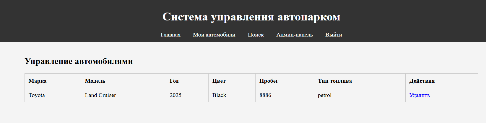

# Отчёт по проекту: Система управления личным автопарком

## Введение

Я разработал веб-приложение "Система управления личным автопарком" на PHP с использованием XAMPP, MySQL и архитектуры MVC. Это приложение позволяет пользователям управлять информацией о своих автомобилях: добавлять, редактировать, удалять и искать транспортные средства. Я реализовал безопасную систему аутентификации, восстановление пароля через код, а также функции администрирования для управления пользователями и автомобилями. В этом отчёте я подробно описываю процесс разработки, структуру проекта, полный код всех файлов, их назначение, функциональность и инструкции по установке и использованию.

## Цель проекта

Я создал это приложение, чтобы:

- Обеспечить пользователей инструментом для управления данными об автомобилях.
- Реализовать безопасную регистрацию, вход и восстановление пароля.
- Предоставить администраторам функции управления пользователями и автомобилями.
- Продемонстрировать мои навыки работы с PHP, MySQL, MVC и веб-разработкой.

Моей задачей было разработать интуитивно понятное, безопасное и масштабируемое приложение, соответствующее требованиям задания.

## Технологии и требования

Я использовал следующие технологии:

- **Сервер**: XAMPP (Apache, MySQL).
- **Язык программирования**: PHP
- **База данных**: MySQL.
- **Frontend**: HTML, CSS.
- **Архитектура**: MVC (Model-View-Controller).

## Установка и запуск

Я организовал проект для простой установки и запуска на локальном сервере. Вот мои шаги:

### 1. Установка XAMPP

Я скачал и установил XAMPP с официального сайта (https://www.apachefriends.org/). После установки я запустил XAMPP Control Panel и включил Apache и MySQL.

### 2. Размещение проекта

Я скопировал папку проекта `vehicle_fleet` в директорию `htdocs`:

- Путь: `C:\xampp\htdocs\vehicle_fleet` (для Windows).
- Структура папок:

```struct
  vehicle_fleet/
  ├── assets/
  │   └── css/
  │       └── styles.css
  ├── config/
  │   └── database.php
  ├── controllers/
  │   ├── AuthController.php
  │   ├── VehicleController.php
  │   └── AdminController.php
  ├── models/
  │   ├── User.php
  │   └── Vehicle.php
  ├── views/
  │   ├── layouts/
  │   │   └── main.php
  │   ├── auth/
  │   │   ├── login.php
  │   │   ├── register.php
  │   │   ├── recover.php
  │   │   └── reset.php
  │   ├── vehicles/
  │   │   ├── index.php
  │   │   ├── create.php
  │   │   ├── edit.php
  │   │   └── search.php
  │   ├── admin/
  │   │   ├── dashboard.php
  │   │   ├── manage_users.php
  │   │   └── manage_vehicles.php
  │   └── home.php
  ├── .htaccess
  ├── index.php
  └── README.md
  ```

### 3. Настройка базы данных

Я создал базу данных `vehicle_fleet` через phpMyAdmin (`http://localhost/phpmyadmin`). Затем я выполнил SQL-код для создания таблиц:

```sql
CREATE TABLE users (
    id INT AUTO_INCREMENT PRIMARY KEY,
    username VARCHAR(50) UNIQUE NOT NULL,
    email VARCHAR(100) UNIQUE NOT NULL,
    password VARCHAR(255) NOT NULL,
    role ENUM('user', 'admin') DEFAULT 'user',
    reset_code VARCHAR(6) NULL,
    created_at TIMESTAMP DEFAULT CURRENT_TIMESTAMP
);

CREATE TABLE vehicles (
    id INT AUTO_INCREMENT PRIMARY KEY,
    user_id INT,
    brand VARCHAR(50) NOT NULL,
    model VARCHAR(50) NOT NULL,
    year INT NOT NULL,
    color VARCHAR(30) NOT NULL,
    mileage INT NOT NULL,
    fuel_type ENUM('petrol', 'diesel', 'electric', 'hybrid') NOT NULL,
    status ENUM('active', 'inactive') DEFAULT 'active',
    created_at TIMESTAMP DEFAULT CURRENT_TIMESTAMP,
    FOREIGN KEY (user_id) REFERENCES users(id)
);
```

- **Описание**:
  - Таблица `users` хранит данные пользователей: уникальный логин, email, хешированный пароль, роль (`user` или `admin`) и код для восстановления пароля.
  - Таблица `vehicles` содержит данные об автомобилях: ID пользователя, марка, модель, год, цвет, пробег, тип топлива и статус. Связь с `users` через `user_id`.

### 4. Настройка подключения

Я настроил подключение к базе данных в файле `config/database.php`:

```php
<?php
function getDBConnection() {
    $host = 'localhost';
    $dbname = 'vehicle_fleet';
    $username = 'root';
    $password = '';
    try {
        $conn = new mysqli($host, $username, $password, $dbname);
        if ($conn->connect_error) {
            throw new Exception("Ошибка подключения: " . $conn->connect_error);
        }
        return $conn;
    } catch (Exception $e) {
        die($e->getMessage());
    }
}
?>
```

- **Что делает**: Создаёт соединение с базой `vehicle_fleet` через `mysqli`. Параметры (`host`, `dbname`, `username`, `password`) подходят для стандартной установки XAMPP. При ошибке подключения выводится сообщение и выполнение прекращается.
- **Как работает**: Функция возвращает объект `mysqli`, который используется моделями для выполнения SQL-запросов.

### 5. Запуск приложения

Я запустил Apache и MySQL в XAMPP, затем открыл `http://localhost/vehicle_fleet` в браузере. Главная страница отобразилась с навигационной панелью и таблицей последних автомобилей.

## Структура проекта

Я использовал архитектуру MVC для разделения логики, данных и представления:

- **Models** (`models/`): Управляют взаимодействием с базой данных.
- **Views** (`views/`): Содержат HTML-шаблоны для страниц.
- **Controllers** (`controllers/`): Обрабатывают запросы и связывают модели с представлениями.

Дополнительные файлы:

- `config/database.php`: Настройки базы данных.
- `assets/css/styles.css`: Стили интерфейса.
- `.htaccess`: Настройки маршрутизации.
- `index.php`: Точка входа.

## Полный код и описание файлов

Ниже я привожу полный код каждого файла, объясняю его назначение, что он делает и как работает.

### 1. Точка входа (`index.php`)

```php
<?php
session_start();
require_once 'config/database.php';
require_once 'controllers/AuthController.php';
require_once 'controllers/VehicleController.php';
require_once 'controllers/AdminController.php';

$authController = new AuthController();
$vehicleController = new VehicleController();
$adminController = new AdminController();

$action = $_GET['action'] ?? 'home';

switch ($action) {
    case 'login':
        $authController->login();
        break;
    case 'register':
        $authController->register();
        break;
    case 'recover':
        $authController->recoverPassword();
        break;
    case 'reset':
        $authController->resetPassword();
        break;
    case 'logout':
        $authController->logout();
        break;
    case 'vehicles':
        $vehicleController->index();
        break;
    case 'create_vehicle':
        $vehicleController->create();
        break;
    case 'edit_vehicle':
        $vehicleController->edit($_GET['id'] ?? 0);
        break;
    case 'delete_vehicle':
        $vehicleController->delete($_GET['id'] ?? 0);
        break;
    case 'search_vehicles':
        $vehicleController->search();
        break;
    case 'admin_dashboard':
        $adminController->dashboard();
        break;
    case 'manage_users':
        $adminController->manageUsers();
        break;
    case 'manage_vehicles':
        $adminController->manageVehicles();
        break;
    default:
        include 'views/home.php';
}
?>
```

- **Назначение**: Основная точка входа, маршрутизирующая запросы.
- **Что делает**:
  - Инициализирует сессию для хранения данных пользователя (`session_start()`).
  - Подключает конфигурацию базы данных и контроллеры.
  - Создаёт экземпляры контроллеров (`AuthController`, `VehicleController`, `AdminController`).
  - Получает параметр `action` из `$_GET` (по умолчанию `home`).
  - Использует `switch` для вызова соответствующих методов контроллеров или включения главной страницы (`home.php`).
- **Как работает**:
  - Если URL, например, `index.php?action=login`, вызывается метод `$authController->login()`.
  - Для неизвестных действий отображается главная страница.
  - Каждый метод контроллера отвечает за обработку запроса и рендеринг представления.

### 2. Подключение к базе данных (`config/database.php`)

```php
<?php
function getDBConnection() {
    $host = 'localhost';
    $dbname = 'vehicle_fleet';
    $username = 'root';
    $password = '';
    try {
        $conn = new mysqli($host, $username, $password, $dbname);
        if ($conn->connect_error) {
            throw new Exception("Ошибка подключения: " . $conn->connect_error);
        }
        return $conn;
    } catch (Exception $e) {
        die($e->getMessage());
    }
}
?>
```

- **Назначение**: Предоставляет функцию для подключения к базе данных.
- **Что делает**:
  - Определяет параметры подключения (`host`, `dbname`, `username`, `password`).
  - Создаёт соединение через `mysqli`.
  - Проверяет ошибки подключения и выбрасывает исключение при сбое.
  - Возвращает объект `mysqli` для использования в моделях.
- **Как работает**:
  - Вызывается моделями (`User.php`, `Vehicle.php`) для выполнения SQL-запросов.
  - Использует параметры по умолчанию XAMPP (пользователь `root` без пароля).
  - При ошибке (например, неверная база) завершает выполнение с сообщением.

### 3. Модель пользователя (`models/User.php`)

```php
<?php
require_once 'config/database.php';

class User {
    private $conn;

    public function __construct() {
        $this->conn = getDBConnection();
    }

    public function register($username, $email, $password, $role = 'user') {
        $username = $this->conn->real_escape_string($username);
        $email = $this->conn->real_escape_string($email);
        $password = password_hash($password, PASSWORD_BCRYPT);
        $role = in_array($role, ['user', 'admin']) ? $role : 'user';
        $sql = "INSERT INTO users (username, email, password, role) VALUES ('$username', '$email', '$password', '$role')";
        return $this->conn->query($sql);
    }

    public function login($username, $password) {
        $username = $this->conn->real_escape_string($username);
        $sql = "SELECT * FROM users WHERE username = '$username'";
        $result = $this->conn->query($sql);
        if ($result->num_rows > 0) {
            $user = $result->fetch_assoc();
            if (password_verify($password, $user['password'])) {
                return $user;
            }
        }
        return null;
    }

    public function generateResetCode($email) {
        $email = $this->conn->real_escape_string($email);
        $code = sprintf("%06d", mt_rand(0, 999999));
        $sql = "UPDATE users SET reset_code = '$code' WHERE email = '$email'";
        if ($this->conn->query($sql) && $this->conn->affected_rows > 0) {
            return $code;
        }
        return null;
    }

    public function resetPassword($email, $code, $newPassword) {
        $email = $this->conn->real_escape_string($email);
        $code = $this->conn->real_escape_string($code);
        $sql = "SELECT * FROM users WHERE email = '$email' AND reset_code = '$code'";
        $result = $this->conn->query($sql);
        if ($result->num_rows > 0) {
            $newPassword = password_hash($newPassword, PASSWORD_BCRYPT);
            $sql = "UPDATE users SET password = '$newPassword', reset_code = NULL WHERE email = '$email'";
            return $this->conn->query($sql);
        }
        return false;
    }

    public function getAll() {
        $sql = "SELECT id, username, email, role, created_at FROM users";
        $result = $this->conn->query($sql);
        return $result->fetch_all(MYSQLI_ASSOC);
    }
}
?>
```

- **Назначение**: Управляет данными пользователей и их операциями.
- **Что делает**:
  - `__construct`: Инициализирует соединение с базой данных.
  - `register`: Создаёт нового пользователя, хешируя пароль (`password_hash`) и экранируя ввод для защиты от SQL-инъекций.
  - `login`: Проверяет логин и пароль, возвращает данные пользователя или `null`.
  - `generateResetCode`: Генерирует 6-значный код и сохраняет его в `reset_code`.
  - `resetPassword`: Проверяет email и код, обновляет пароль и очищает `reset_code`.
  - `getAll`: Возвращает список всех пользователей для админ-панели.
- **Как работает**:
  - Использует `mysqli` для выполнения запросов.
  - Экранирует ввод (`real_escape_string`) для безопасности.
  - Хеширует пароли с алгоритмом BCRYPT.
  - Вызывается контроллером `AuthController` для обработки аутентификации.

### 4. Модель автомобиля (`models/Vehicle.php`)

```php
<?php
require_once 'config/database.php';

class Vehicle {
    private $conn;

    public function __construct() {
        $this->conn = getDBConnection();
    }

    public function create($user_id, $brand, $model, $year, $color, $mileage, $fuel_type) {
        $user_id = (int)$user_id;
        $brand = $this->conn->real_escape_string($brand);
        $model = $this->conn->real_escape_string($model);
        $year = (int)$year;
        $color = $this->conn->real_escape_string($color);
        $mileage = (int)$mileage;
        $fuel_type = $this->conn->real_escape_string($fuel_type);
        if ($year < 1900 || $year > date('Y')) {
            return false;
        }
        if (!in_array($fuel_type, ['petrol', 'diesel', 'electric', 'hybrid'])) {
            return false;
        }
        $sql = "INSERT INTO vehicles (user_id, brand, model, year, color, mileage, fuel_type) VALUES ($user_id, '$brand', '$model', $year, '$color', $mileage, '$fuel_type')";
        return $this->conn->query($sql);
    }

    public function getByUserId($user_id) {
        $user_id = (int)$user_id;
        $sql = "SELECT * FROM vehicles WHERE user_id = $user_id AND status = 'active'";
        $result = $this->conn->query($sql);
        return $result->fetch_all(MYSQLI_ASSOC);
    }

    public function getById($id, $user_id) {
        $id = (int)$id;
        $user_id = (int)$user_id;
        $sql = "SELECT * FROM vehicles WHERE id = $id AND user_id = $user_id";
        $result = $this->conn->query($sql);
        return $result->fetch_assoc();
    }

    public function update($id, $user_id, $brand, $model, $year, $color, $mileage, $fuel_type) {
        $id = (int)$id;
        $user_id = (int)$user_id;
        $brand = $this->conn->real_escape_string($brand);
        $model = $this->conn->real_escape_string($model);
        $year = (int)$year;
        $color = $this->conn->real_escape_string($color);
        $mileage = (int)$mileage;
        $fuel_type = $this->conn->real_escape_string($fuel_type);
        if ($year < 1900 || $year > date('Y')) {
            return false;
        }
        if (!in_array($fuel_type, ['petrol', 'diesel', 'electric', 'hybrid'])) {
            return false;
        }
        $sql = "UPDATE vehicles SET brand = '$brand', model = '$model', year = $year, color = '$color', mileage = $mileage, fuel_type = '$fuel_type' WHERE id = $id AND user_id = $user_id";
        return $this->conn->query($sql);
    }

    public function delete($id, $user_id) {
        $id = (int)$id;
        $user_id = (int)$user_id;
        $sql = "UPDATE vehicles SET status = 'inactive' WHERE id = $id AND user_id = $user_id";
        return $this->conn->query($sql);
    }

    public function search($brand = '', $year = 0) {
        $conditions = [];
        if (!empty($brand)) {
            $brand = $this->conn->real_escape_string($brand);
            $conditions[] = "brand LIKE '%$brand%'";
        }
        if ($year > 0) {
            $year = (int)$year;
            $conditions[] = "year = $year";
        }
        $sql = "SELECT * FROM vehicles WHERE status = 'active'";
        if (!empty($conditions)) {
            $sql .= " AND " . implode(" AND ", $conditions);
        }
        $result = $this->conn->query($sql);
        return $result->fetch_all(MYSQLI_ASSOC);
    }

    public function getAll() {
        $sql = "SELECT * FROM vehicles WHERE status = 'active'";
        $result = $this->conn->query($sql);
        return $result->fetch_all(MYSQLI_ASSOC);
    }

    public function adminDelete($id) {
        $id = (int)$id;
        $sql = "UPDATE vehicles SET status = 'inactive' WHERE id = $id";
        return $this->conn->query($sql);
    }
}
?>
```

- **Назначение**: Управляет данными автомобилей.
- **Что делает**:
  - `__construct`: Инициализирует соединение с базой.
  - `create`: Добавляет автомобиль, проверяя год и тип топлива.
  - `getByUserId`: Возвращает активные автомобили пользователя.
  - `getById`: Получает данные автомобиля по ID и `user_id`.
  - `update`: Обновляет данные автомобиля с валидацией.
  - `delete`: Помечает автомобиль как неактивный.
  - `search`: Ищет автомобили по марке и/или году.
  - `getAll`: Возвращает все активные автомобили.
  - `adminDelete`: Удаляет автомобиль (для админов, без проверки `user_id`).
- **Как работает**:
  - Экранирует строковые данные для безопасности.
  - Проверяет корректность года (1900–текущий год) и типа топлива.
  - Используется контроллером `VehicleController` для операций с автомобилями.

### 5. Контроллер аутентификации (`controllers/AuthController.php`)

```php
<?php
require_once 'models/User.php';

class AuthController {
    private $user;

    public function __construct() {
        $this->user = new User();
    }

    public function login() {
        if ($_SERVER['REQUEST_METHOD'] === 'POST') {
            $username = trim($_POST['username']);
            $password = trim($_POST['password']);
            if (empty($username) || empty($password)) {
                $error = "Заполните все поля";
            } else {
                $user = $this->user->login($username, $password);
                if ($user) {
                    $_SESSION['user_id'] = $user['id'];
                    $_SESSION['role'] = $user['role'];
                    header('Location: index.php?action=vehicles');
                    exit;
                } else {
                    $error = "Неверный логин или пароль";
                }
            }
        }
        include 'views/auth/login.php';
    }

    public function register() {
        if ($_SERVER['REQUEST_METHOD'] === 'POST') {
            $username = trim($_POST['username']);
            $email = trim($_POST['email']);
            $password = trim($_POST['password']);
            $confirm_password = trim($_POST['confirm_password']);
            if (empty($username) || empty($email) || empty($password) || empty($confirm_password)) {
                $error = "Заполните все поля";
            } elseif ($password !== $confirm_password) {
                $error = "Пароли не совпадают";
            } elseif (!filter_var($email, FILTER_VALIDATE_EMAIL)) {
                $error = "Неверный формат email";
            } else {
                if ($this->user->register($username, $email, $password)) {
                    $success = "Регистрация успешна. Войдите в систему.";
                } else {
                    $error = "Ошибка регистрации. Попробуйте снова.";
                }
            }
        }
        include 'views/auth/register.php';
    }

    public function recoverPassword() {
        if ($_SERVER['REQUEST_METHOD'] === 'POST') {
            $email = trim($_POST['email']);
            if (empty($email) || !filter_var($email, FILTER_VALIDATE_EMAIL)) {
                $error = "Введите корректный email";
            } else {
                $code = $this->user->generateResetCode($email);
                if ($code) {
                    $_SESSION['reset_email'] = $email;
                    $_SESSION['reset_code'] = $code;
                    header('Location: index.php?action=reset');
                    exit;
                } else {
                    $error = "Email не найден";
                }
            }
        }
        include 'views/auth/recover.php';
    }

    public function resetPassword() {
        if (!isset($_SESSION['reset_email'])) {
            header('Location: index.php?action=recover');
            exit;
        }
        if ($_SERVER['REQUEST_METHOD'] === 'POST') {
            $email = $_SESSION['reset_email'];
            $code = trim($_POST['code']);
            $new_password = trim($_POST['new_password']);
            $confirm_password = trim($_POST['confirm_password']);
            if (empty($code) || empty($new_password) || empty($confirm_password)) {
                $error = "Заполните все поля";
            } elseif ($new_password !== $confirm_password) {
                $error = "Пароли не совпадают";
            } else {
                if ($this->user->resetPassword($email, $code, $new_password)) {
                    unset($_SESSION['reset_email']);
                    unset($_SESSION['reset_code']);
                    $success = "Пароль успешно изменён. Войдите в систему.";
                    include 'views/auth/login.php';
                    return;
                } else {
                    $error = "Неверный код восстановления";
                }
            }
        }
        include 'views/auth/reset.php';
    }

    public function logout() {
        session_destroy();
        header('Location: index.php');
        exit;
    }
}
?>
```

- **Назначение**: Управляет аутентификацией и восстановлением пароля.
- **Что делает**:
  - `__construct`: Создаёт экземпляр модели `User`.
  - `login`: Обрабатывает вход, проверяет поля, сохраняет сессию и перенаправляет.
  - `register`: Регистрирует пользователя, валидируя данные.
  - `recoverPassword`: Генерирует код восстановления и перенаправляет на сброс.
  - `resetPassword`: Проверяет код, обновляет пароль, возвращает на страницу входа.
  - `logout`: Уничтожает сессию и перенаправляет на главную.
- **Как работает**:
  - Использует модель `User` для операций с базой.
  - Проверяет данные формы через `$_POST`.
  - Сохраняет временные данные (email, код) в `$_SESSION`.
  - Включает соответствующие представления (`login.php`, `register.php`, и т.д.).

### 6. Контроллер автомобилей (`controllers/VehicleController.php`)

```php
<?php
require_once 'models/Vehicle.php';

class VehicleController {
    private $vehicle;

    public function __construct() {
        $this->vehicle = new Vehicle();
    }

    public function index() {
        if (!isset($_SESSION['user_id'])) {
            header('Location: index.php?action=login');
            exit;
        }
        $vehicles = $this->vehicle->getByUserId($_SESSION['user_id']);
        include 'views/vehicles/index.php';
    }

    public function create() {
        if (!isset($_SESSION['user_id'])) {
            header('Location: index.php?action=login');
            exit;
        }
        if ($_SERVER['REQUEST_METHOD'] === 'POST') {
            $brand = trim($_POST['brand']);
            $model = trim($_POST['model']);
            $year = (int)$_POST['year'];
            $color = trim($_POST['color']);
            $mileage = (int)$_POST['mileage'];
            $fuel_type = trim($_POST['fuel_type']);
            if (empty($brand) || empty($model) || empty($year) || empty($color) || empty($mileage) || empty($fuel_type)) {
                $error = "Заполните все поля";
            } elseif ($year < 1900 || $year > date('Y')) {
                $error = "Некорректный год";
            } else {
                if ($this->vehicle->create($_SESSION['user_id'], $brand, $model, $year, $color, $mileage, $fuel_type)) {
                    header('Location: index.php?action=vehicles');
                    exit;
                } else {
                    $error = "Ошибка добавления автомобиля";
                }
            }
        }
        include 'views/vehicles/create.php';
    }

    public function edit($id) {
        if (!isset($_SESSION['user_id'])) {
            header('Location: index.php?action=login');
            exit;
        }
        $id = (int)$id;
        $vehicle = $this->vehicle->getById($id, $_SESSION['user_id']);
        if (!$vehicle) {
            header('Location: index.php?action=vehicles');
            exit;
        }
        if ($_SERVER['REQUEST_METHOD'] === 'POST') {
            $brand = trim($_POST['brand']);
            $model = trim($_POST['model']);
            $year = (int)$_POST['year'];
            $color = trim($_POST['color']);
            $mileage = (int)$_POST['mileage'];
            $fuel_type = trim($_POST['fuel_type']);
            if (empty($brand) || empty($model) || empty($year) || empty($color) || empty($mileage) || empty($fuel_type)) {
                $error = "Заполните все поля";
            } elseif ($year < 1900 || $year > date('Y')) {
                $error = "Некорректный год";
            } else {
                if ($this->vehicle->update($id, $_SESSION['user_id'], $brand, $model, $year, $color, $mileage, $fuel_type)) {
                    header('Location: index.php?action=vehicles');
                    exit;
                } else {
                    $error = "Ошибка редактирования";
                }
            }
        }
        include 'views/vehicles/edit.php';
    }

    public function delete($id) {
        if (!isset($_SESSION['user_id'])) {
            header('Location: index.php?action=login');
            exit;
        }
        $id = (int)$id;
        $this->vehicle->delete($id, $_SESSION['user_id']);
        header('Location: index.php?action=vehicles');
        exit;
    }

    public function search() {
        $vehicles = [];
        if ($_SERVER['REQUEST_METHOD'] === 'POST') {
            $brand = trim($_POST['brand']);
            $year = (int)$_POST['year'];
            $vehicles = $this->vehicle->search($brand, $year);
        }
        include 'views/vehicles/search.php';
    }
}
?>
```

- **Назначение**: Управляет операциями с автомобилями.
- **Что делает**:
  - `__construct`: Создаёт экземпляр модели `Vehicle`.
  - `index`: Показывает автомобили пользователя.
  - `create`: Обрабатывает добавление автомобиля, валидирует данные.
  - `edit`: Позволяет редактировать автомобиль, проверяет его существование.
  - `delete`: Удаляет автомобиль (помечает как неактивный).
  - `search`: Обрабатывает поиск автомобилей.
- **Как работает**:
  - Проверяет авторизацию (`$_SESSION['user_id']`) для защищённых действий.
  - Валидирует данные формы (`$_POST`) перед передачей в модель.
  - Перенаправляет на соответствующие страницы после операций.
  - Включает представления для рендеринга.

### 7. Контроллер администратора (`controllers/AdminController.php`)

```php
<?php
require_once 'models/User.php';
require_once 'models/Vehicle.php';

class AdminController {
    private $user;
    private $vehicle;

    public function __construct() {
        $this->user = new User();
        $this->vehicle = new Vehicle();
    }

    public function dashboard() {
        if (!isset($_SESSION['user_id']) || $_SESSION['role'] !== 'admin') {
            header('Location: index.php?action=login');
            exit;
        }
        include 'views/admin/dashboard.php';
    }

    public function manageUsers() {
        if (!isset($_SESSION['user_id']) || $_SESSION['role'] !== 'admin') {
            header('Location: index.php?action=login');
            exit;
        }
        $users = $this->user->getAll();
        if ($_SERVER['REQUEST_METHOD'] === 'POST') {
            $username = trim($_POST['username']);
            $email = trim($_POST['email']);
            $password = trim($_POST['password']);
            $role = trim($_POST['role']);
            if (empty($username) || empty($email) || empty($password) || empty($role)) {
                $error = "Заполните все поля";
            } elseif (!filter_var($email, FILTER_VALIDATE_EMAIL)) {
                $error = "Неверный формат email";
            } else {
                if ($this->user->register($username, $email, $password, $role)) {
                    $success = "Пользователь добавлен";
                    $users = $this->user->getAll();
                } else {
                    $error = "Ошибка добавления пользователя";
                }
            }
        }
        include 'views/admin/manage_users.php';
    }

    public function manageVehicles() {
        if (!isset($_SESSION['user_id']) || $_SESSION['role'] !== 'admin') {
            header('Location: index.php?action=login');
            exit;
        }
        $vehicles = $this->vehicle->getAll();
        if (isset($_GET['delete_id'])) {
            $this->vehicle->adminDelete((int)$_GET['delete_id']);
            header('Location: index.php?action=manage_vehicles');
            exit;
        }
        include 'views/admin/manage_vehicles.php';
    }
}
?>
```

- **Назначение**: Управляет функциями администрирования.
- **Что делает**:
  - `__construct`: Создаёт экземпляры моделей `User` и `Vehicle`.
  - `dashboard`: Отображает главную страницу админ-панели.
  - `manageUsers`: Позволяет добавлять пользователей и просматривать их список.
  - `manageVehicles`: Показывает все автомобили и позволяет их удалять.
- **Как работает**:
  - Проверяет роль администратора (`$_SESSION['role'] === 'admin'`).
  - Обрабатывает формы для добавления пользователей.
  - Вызывает методы моделей для получения и удаления данных.
  - Включает соответствующие представления.

### 8. Основной шаблон (`views/layouts/main.php`)

```php
<!DOCTYPE html>
<html lang="ru">
<head>
    <meta charset="UTF-8">
    <title>Система управления автопарком</title>
    <link rel="stylesheet" href="assets/css/styles.css">
</head>
<body>
    <header>
        <h1>Система управления автопарком</h1>
        <nav>
            <a href="index.php">Главная</a>
            <a href="index.php?action=vehicles">Мои автомобили</a>
            <a href="index.php?action=search_vehicles">Поиск</a>
            <?php if (isset($_SESSION['user_id'])): ?>
                <?php if ($_SESSION['role'] === 'admin'): ?>
                    <a href="index.php?action=admin_dashboard">Админ-панель</a>
                <?php endif; ?>
                <a href="index.php?action=logout">Выйти</a>
            <?php else: ?>
                <a href="index.php?action=login">Вход</a>
                <a href="index.php?action=register">Регистрация</a>
            <?php endif; ?>
        </nav>
    </header>
    <div class="container">
        <?php echo $content; ?>
    </div>
</body>
</html>
```

- **Назначение**: Основной шаблон для всех страниц.
- **Что делает**:
  - Определяет HTML-структуру с заголовком, навигацией и контейнером для контента.
  - Подключает стили (`styles.css`).
  - Динамически отображает ссылки в навигации в зависимости от статуса авторизации и роли пользователя.
  - Вставляет контент страницы через переменную `$content`.
- **Как работает**:
  - Используется всеми представлениями через `include '../layouts/main.php'`.
  - Проверяет `$_SESSION` для отображения ссылок "Выйти" или "Вход"/"Регистрация".
  - Выводит `$content`, сформированный в представлениях через буферизацию вывода (`ob_start`, `ob_get_clean`).

### 9. Главная страница (`views/home.php`)

```php
<?php
ob_start();
require_once 'config/database.php';
$conn = getDBConnection();
$sql = "SELECT brand, model, year FROM vehicles ORDER BY created_at DESC LIMIT 3";
$result = $conn->query($sql);
$vehicles = $result->fetch_all(MYSQLI_ASSOC);
?>
<h2>Добро пожаловать</h2>
<h3>Последние добавленные автомобили</h3>
<table>
    <tr>
        <th>Марка</th>
        <th>Модель</th>
        <th>Год</th>
    </tr>
    <?php foreach ($vehicles as $vehicle): ?>
        <tr>
            <td><?php echo htmlspecialchars($vehicle['brand']); ?></td>
            <td><?php echo htmlspecialchars($vehicle['model']); ?></td>
            <td><?php echo htmlspecialchars($vehicle['year']); ?></td>
        </tr>
    <?php endforeach; ?>
</table>
<?php
$content = ob_get_clean();
include '../layouts/main.php';
?>
```

- **Назначение**: Отображает главную страницу.
- **Что делает**:
  - Запрашивает три последних автомобиля из базы.
  - Формирует таблицу с маркой, моделью и годом.
  - Использует буферизацию вывода для формирования `$content`.
- **Как работает**:
  - Выполняет SQL-запрос через `mysqli`.
  - Экранирует вывод (`htmlspecialchars`) для защиты от XSS.
  - Включает основной шаблон для рендеринга.

### 10. Страница входа (`views/auth/login.php`)

```php
<?php
ob_start();
?>
<h2>Вход</h2>
<?php if (isset($error)): ?>
    <p class="error"><?php echo htmlspecialchars($error); ?></p>
<?php endif; ?>
<form method="POST">
    <label>Логин</label>
    <input type="text" name="username" required>
    <label>Пароль</label>
    <input type="password" name="password" required>
    <button type="submit">Войти</button>
</form>
<p><a href="index.php?action=recover">Забыли пароль?</a></p>
<?php
$content = ob_get_clean();
include '../layouts/main.php';
?>
```

- **Назначение**: Форма входа.
- **Что делает**:
  - Отображает поля для логина и пароля.
  - Показывает ошибки, если они переданы контроллером.
  - Содержит ссылку на восстановление пароля.
- **Как работает**:
  - Форма отправляет данные в `AuthController::login` через `POST`.
  - Экранирует ошибки для безопасности.
  - Буферизирует вывод и включает основной шаблон.

### 11. Страница регистрации (`views/auth/register.php`)

```php
<?php
ob_start();
?>
<h2>Регистрация</h2>
<?php if (isset($error)): ?>
    <p class="error"><?php echo htmlspecialchars($error); ?></p>
<?php endif; ?>
<?php if (isset($success)): ?>
    <p class="success"><?php echo htmlspecialchars($success); ?></p>
<?php endif; ?>
<form method="POST">
    <label>Логин</label>
    <input type="text" name="username" required>
    <label>Email</label>
    <input type="email" name="email" required>
    <label>Пароль</label>
    <input type="password" name="password" required>
    <label>Подтверждение пароля</label>
    <input type="password" name="confirm_password" required>
    <button type="submit">Зарегистрироваться</button>
</form>
<?php
$content = ob_get_clean();
include '../layouts/main.php';
?>
```

- **Назначение**: Форма регистрации.
- **Что делает**:
  - Отображает поля для логина, email, пароля и подтверждения.
  - Показывает ошибки или сообщение об успехе.
- **Как работает**:
  - Отправляет данные в `AuthController::register`.
  - Экранирует сообщения для защиты от XSS.
  - Использует буферизацию вывода.

### 12. Страница восстановления пароля (`views/auth/recover.php`)

```php
<?php
ob_start();
?>
<h2>Восстановление пароля</h2>
<?php if (isset($error)): ?>
    <p class="error"><?php echo htmlspecialchars($error); ?></p>
<?php endif; ?>
<?php if (isset($_SESSION['reset_code'])): ?>
    <p class="success">Код восстановления отправлен на ваш email (эмуляция). Переход на страницу сброса...</p>
    <meta http-equiv="refresh" content="2;url=index.php?action=reset">
<?php else: ?>
    <form method="POST">
        <label>Email</label>
        <input type="email" name="email" required>
        <button type="submit">Отправить код</button>
    </form>
<?php endif; ?>
<?php
$content = ob_get_clean();
include '../layouts/main.php';
?>
```

- **Назначение**: Запрашивает email для восстановления пароля.
- **Что делает**:
  - Отображает форму для ввода email.
  - После отправки показывает сообщение и перенаправляет на страницу сброса через 2 секунды.
  - Показывает ошибки, если email неверный.
- **Как работает**:
  - Форма отправляет email в `AuthController::recoverPassword`.
  - Тег `<meta http-equiv="refresh">` выполняет редирект.
  - Проверяет `$_SESSION['reset_code']` для отображения сообщения.

### 13. Страница сброса пароля (`views/auth/reset.php`)

```php
<?php
ob_start();
?>
<h2>Сброс пароля</h2>
<?php if (isset($error)): ?>
    <p class="error"><?php echo htmlspecialchars($error); ?></p>
<?php endif; ?>
<p>Код восстановления: <?php echo isset($_SESSION['reset_code']) ? htmlspecialchars($_SESSION['reset_code']) : 'не доступен'; ?> (в реальном приложении отправляется на email)</p>
<form method="POST">
    <label>Код восстановления</label>
    <input type="text" name="code" required>
    <label>Новый пароль</label>
    <input type="password" name="new_password" required>
    <label>Подтверждение пароля</label>
    <input type="password" name="confirm_password" required>
    <button type="submit">Сбросить пароль</button>
</form>
<?php
$content = ob_get_clean();
include '../layouts/main.php';
?>
```

- **Назначение**: Позволяет сбросить пароль, введя код и новый пароль.
- **Что делает**:
  - Отображает код (для эмуляции) и форму для ввода кода и пароля.
  - Показывает ошибки, если код или пароли неверные.
- **Как работает**:
  - Форма отправляет данные в `AuthController::resetPassword`.
  - Экранирует код и ошибки для безопасности.
  - Успешный сброс перенаправляет на страницу входа.

### 14. Список автомобилей (`views/vehicles/index.php`)

```php
<?php
ob_start();
if (!isset($_SESSION['user_id'])) {
    header('Location: index.php?action=login');
    exit;
}
require_once 'config/database.php';
require_once 'models/Vehicle.php';
$vehicleModel = new Vehicle();
$vehicles = $vehicleModel->getByUserId($_SESSION['user_id']);
?>
<h2>Мои автомобили</h2>
<p><a href="index.php?action=create_vehicle">Добавить автомобиль</a></p>
<table>
    <tr>
        <th>Марка</th>
        <th>Модель</th>
        <th>Год</th>
        <th>Цвет</th>
        <th>Пробег</th>
        <th>Тип топлива</th>
        <th>Действия</th>
    </tr>
    <?php foreach ($vehicles as $vehicle): ?>
        <tr>
            <td><?php echo htmlspecialchars($vehicle['brand']); ?></td>
            <td><?php echo htmlspecialchars($vehicle['model']); ?></td>
            <td><?php echo htmlspecialchars($vehicle['year']); ?></td>
            <td><?php echo htmlspecialchars($vehicle['color']); ?></td>
            <td><?php echo htmlspecialchars($vehicle['mileage']); ?></td>
            <td><?php echo htmlspecialchars($vehicle['fuel_type']); ?></td>
            <td>
                <a href="index.php?action=edit_vehicle&id=<?php echo $vehicle['id']; ?>">Редактировать</a>
                <a href="index.php?action=delete_vehicle&id=<?php echo $vehicle['id']; ?>" onclick="return confirm('Вы уверены?')">Удалить</a>
            </td>
        </tr>
    <?php endforeach; ?>
</table>
<?php
$content = ob_get_clean();
include '../layouts/main.php';
?>
```

- **Назначение**: Отображает автомобили пользователя.
- **Что делает**:
  - Проверяет авторизацию.
  - Получает автомобили через модель `Vehicle`.
  - Формирует таблицу с данными и ссылками для редактирования/удаления.
- **Как работает**:
  - Вызывает `Vehicle::getByUserId` для получения данных.
  - Экранирует вывод для защиты от XSS.
  - Добавляет ссылку на добавление автомобиля.

### 15. Добавление автомобиля (`views/vehicles/create.php`)

```php
<?php
ob_start();
if (!isset($_SESSION['user_id'])) {
    header('Location: index.php?action=login');
    exit;
}
?>
<h2>Добавить автомобиль</h2>
<?php if (isset($error)): ?>
    <p class="error"><?php echo htmlspecialchars($error); ?></p>
<?php endif; ?>
<form method="POST">
    <label>Марка</label>
    <input type="text" name="brand" required>
    <label>Модель</label>
    <input type="text" name="model" required>
    <label>Год</label>
    <input type="number" name="year" required>
    <label>Цвет</label>
    <input type="text" name="color" required>
    <label>Пробег</label>
    <input type="number" name="mileage" required>
    <label>Тип топлива</label>
    <select name="fuel_type" required>
        <option value="petrol">Бензин</option>
        <option value="diesel">Дизель</option>
        <option value="electric">Электрический</option>
        <option value="hybrid">Гибрид</option>
    </select>
    <button type="submit">Добавить</button>
</form>
<?php
$content = ob_get_clean();
include '../layouts/main.php';
?>
```

- **Назначение**: Форма для добавления автомобиля.
- **Что делает**:
  - Проверяет авторизацию.
  - Отображает форму с полями для данных автомобиля.
  - Показывает ошибки, если переданы.
- **Как работает**:
  - Форма отправляет данные в `VehicleController::create`.
  - Поля валидируются контроллером и моделью.

### 16. Редактирование автомобиля (`views/vehicles/edit.php`)

```php
<?php
ob_start();
if (!isset($_SESSION['user_id'])) {
    header('Location: index.php?action=login');
    exit;
}
if (!isset($vehicle)) {
    header('Location: index.php?action=vehicles');
    exit;
}
?>
<h2>Редактировать автомобиль</h2>
<?php if (isset($error)): ?>
    <p class="error"><?php echo htmlspecialchars($error); ?></p>
<?php endif; ?>
<form method="POST">
    <label>Марка</label>
    <input type="text" name="brand" value="<?php echo htmlspecialchars($vehicle['brand']); ?>" required>
    <label>Модель</label>
    <input type="text" name="model" value="<?php echo htmlspecialchars($vehicle['model']); ?>" required>
    <label>Год</label>
    <input type="number" name="year" value="<?php echo htmlspecialchars($vehicle['year']); ?>" required>
    <label>Цвет</label>
    <input type="text" name="color" value="<?php echo htmlspecialchars($vehicle['color']); ?>" required>
    <label>Пробег</label>
    <input type="number" name="mileage" value="<?php echo htmlspecialchars($vehicle['mileage']); ?>" required>
    <label>Тип топлива</label>
    <select name="fuel_type" required>
        <option value="petrol" <?php echo $vehicle['fuel_type'] === 'petrol' ? 'selected' : ''; ?>>Бензин</option>
        <option value="diesel" <?php echo $vehicle['fuel_type'] === 'diesel' ? 'selected' : ''; ?>>Дизель</option>
        <option value="electric" <?php echo $vehicle['fuel_type'] === 'electric' ? 'selected' : ''; ?>>Электрический</option>
        <option value="hybrid" <?php echo $vehicle['fuel_type'] === 'hybrid' ? 'selected' : ''; ?>>Гибрид</option>
    </select>
    <button type="submit">Сохранить</button>
</form>
<?php
$content = ob_get_clean();
include '../layouts/main.php';
?>
```

- **Назначение**: Форма для редактирования автомобиля.
- **Что делает**:
  - Проверяет авторизацию и существование автомобиля.
  - Заполняет форму текущими данными автомобиля.
  - Показывает ошибки.
- **Как работает**:
  - Форма отправляет данные в `VehicleController::edit`.
  - Использует данные `$vehicle` от контроллера.
  - Экранирует вывод и выбирает текущий тип топлива.

### 17. Поиск автомобилей (`views/vehicles/search.php`)

```php
<?php
ob_start();
require_once 'config/database.php';
require_once 'models/Vehicle.php';
$vehicleModel = new Vehicle();
$vehicles = [];
if ($_SERVER['REQUEST_METHOD'] === 'POST') {
    $brand = trim($_POST['brand']);
    $year = (int)$_POST['year'];
    $vehicles = $vehicleModel->search($brand, $year);
}
?>
<h2>Поиск автомобилей</h2>
<form method="POST">
    <label>Марка</label>
    <input type="text" name="brand">
    <label>Год</label>
    <input type="number" name="year">
    <button type="submit">Поиск</button>
</form>
<table>
    <tr>
        <th>Марка</th>
        <th>Модель</th>
        <th>Год</th>
        <th>Цвет</th>
        <th>Пробег</th>
        <th>Тип топлива</th>
    </tr>
    <?php foreach ($vehicles as $vehicle): ?>
        <tr>
            <td><?php echo htmlspecialchars($vehicle['brand']); ?></td>
            <td><?php echo htmlspecialchars($vehicle['model']); ?></td>
            <td><?php echo htmlspecialchars($vehicle['year']); ?></td>
            <td><?php echo htmlspecialchars($vehicle['color']); ?></td>
            <td><?php echo htmlspecialchars($vehicle['mileage']); ?></td>
            <td><?php echo htmlspecialchars($vehicle['fuel_type']); ?></td>
        </tr>
    <?php endforeach; ?>
</table>
<?php
$content = ob_get_clean();
include '../layouts/main.php';
?>
```

- **Назначение**: Форма для поиска автомобилей.
- **Что делает**:
  - Отображает форму для ввода марки и года.
  - Показывает результаты поиска в таблице.
- **Как работает**:
  - Форма отправляет данные в `VehicleController::search`.
  - Модель `Vehicle` выполняет поиск и возвращает результаты.
  - Экранирует вывод данных.

### 18. Админ-панель (`views/admin/dashboard.php`)

```php
<?php
ob_start();
if (!isset($_SESSION['user_id']) || $_SESSION['role'] !== 'admin') {
    header('Location: index.php?action=login');
    exit;
}
?>
<h2>Панель администратора</h2>
<p><a href="index.php?action=manage_users">Управление пользователями</a></p>
<p><a href="index.php?action=manage_vehicles">Управление автомобилями</a></p>
<?php
$content = ob_get_clean();
include '../layouts/main.php';
?>
```

- **Назначение**: Главная страница админ-панели.
- **Что делает**:
  - Проверяет роль администратора.
  - Отображает ссылки на управление пользователями и автомобилями.
- **Как работает**:
  - Перенаправляет неавторизованных или неадминов на страницу входа.
  - Формирует простой интерфейс для навигации.

### 19. Управление пользователями (`views/admin/manage_users.php`)

```php
<?php
ob_start();
if (!isset($_SESSION['user_id']) || $_SESSION['role'] !== 'admin') {
    header('Location: index.php?action=login');
    exit;
}
?>
<h2>Управление пользователями</h2>
<?php if (isset($error)): ?>
    <p class="error"><?php echo htmlspecialchars($error); ?></p>
<?php endif; ?>
<?php if (isset($success)): ?>
    <p class="success"><?php echo htmlspecialchars($success); ?></p>
<?php endif; ?>
<form method="POST">
    <label>Логин</label>
    <input type="text" name="username" required>
    <label>Email</label>
    <input type="email" name="email" required>
    <label>Пароль</label>
    <input type="password" name="password" required>
    <label>Роль</label>
    <select name="role" required>
        <option value="user">Пользователь</option>
        <option value="admin">Администратор</option>
    </select>
    <button type="submit">Добавить пользователя</button>
</form>
<h3>Список пользователей</h3>
<table>
    <tr>
        <th>ID</th>
        <th>Логин</th>
        <th>Email</th>
        <th>Роль</th>
        <th>Дата регистрации</th>
    </tr>
    <?php foreach ($users as $user): ?>
        <tr>
            <td><?php echo htmlspecialchars($user['id']); ?></td>
            <td><?php echo htmlspecialchars($user['username']); ?></td>
            <td><?php echo htmlspecialchars($user['email']); ?></td>
            <td><?php echo htmlspecialchars($user['role']); ?></td>
            <td><?php echo htmlspecialchars($user['created_at']); ?></td>
        </tr>
    <?php endforeach; ?>
</table>
<?php
$content = ob_get_clean();
include '../layouts/main.php';
?>
```

- **Назначение**: Управление пользователями в админ-панели.
- **Что делает**:
  - Проверяет роль администратора.
  - Отображает форму для добавления пользователя.
  - Показывает список всех пользователей.
- **Как работает**:
  - Форма отправляет данные в `AdminController::manageUsers`.
  - Использует массив `$users` от контроллера.
  - Экранирует данные для безопасности.

### 20. Управление автомобилями (`views/admin/manage_vehicles.php`)

```php
<?php
ob_start();
if (!isset($_SESSION['user_id']) || $_SESSION['role'] !== 'admin') {
    header('Location: index.php?action=login');
    exit;
}
?>
<h2>Управление автомобилями</h2>
<table>
    <tr>
        <th>Марка</th>
        <th>Модель</th>
        <th>Год</th>
        <th>Цвет</th>
        <th>Пробег</th>
        <th>Тип топлива</th>
        <th>Действия</th>
    </tr>
    <?php foreach ($vehicles as $vehicle): ?>
        <tr>
            <td><?php echo htmlspecialchars($vehicle['brand']); ?></td>
            <td><?php echo htmlspecialchars($vehicle['model']); ?></td>
            <td><?php echo htmlspecialchars($vehicle['year']); ?></td>
            <td><?php echo htmlspecialchars($vehicle['color']); ?></td>
            <td><?php echo htmlspecialchars($vehicle['mileage']); ?></td>
            <td><?php echo htmlspecialchars($vehicle['fuel_type']); ?></td>
            <td>
                <a href="index.php?action=manage_vehicles&delete_id=<?php echo $vehicle['id']; ?>" onclick="return confirm('Вы уверены?')">Удалить</a>
            </td>
        </tr>
    <?php endforeach; ?>
</table>
<?php
$content = ob_get_clean();
include '../layouts/main.php';
?>
```

- **Назначение**: Управление всеми автомобилями в админ-панели.
- **Что делает**:
  - Проверяет роль администратора.
  - Отображает таблицу всех автомобилей с возможностью удаления.
- **Как работает**:
  - Использует массив `$vehicles` от `AdminController::manageVehicles`.
  - Ссылки на удаление отправляют запрос в контроллер через `delete_id`.

### 21. Стили (`assets/css/styles.css`)

```css
body {
    font-family: Arial, sans-serif;
    margin: 0;
    padding: 0;
}
header {
    background: #333;
    color: white;
    padding: 10px;
    text-align: center;
}
nav a {
    color: white;
    margin: 0 10px;
    text-decoration: none;
}
nav a:hover {
    text-decoration: underline;
}
.container {
    max-width: 800px;
    margin: 20px auto;
    padding: 0 20px;
}
h2 {
    color: #333;
}
form {
    display: flex;
    flex-direction: column;
    gap: 10px;
    max-width: 400px;
}
label {
    font-weight: bold;
}
input, select, button {
    padding: 8px;
    font-size: 16px;
}
button {
    background: #333;
    color: white;
    border: none;
    cursor: pointer;
}
button:hover {
    background: #555;
}
table {
    width: 100%;
    border-collapse: collapse;
    margin-top: 20px;
}
th, td {
    border: 1px solid #ccc;
    padding: 8px;
    text-align: left;
}
th {
    background: #f4f4f4;
}
.error {
    color: red;
}
.success {
    color: green;
}
```

- **Назначение**: Задаёт визуальный стиль приложения.
- **Что делает**:
  - Устанавливает шрифт, отступы и центрирование.
  - Стилизует заголовок (`header`) с тёмным фоном.
  - Форматирует навигацию, формы, таблицы и сообщения об ошибках/успехе.
- **Как работает**:
  - Подключается через `<link>` в `main.php`.
  - Использует CSS-селекторы для стилизации элементов.

### 22. Настройки Apache (`.htaccess`)

```apache
RewriteEngine On
RewriteCond %{REQUEST_FILENAME} !-f
RewriteCond %{REQUEST_FILENAME} !-d
RewriteRule ^(.*)$ index.php [QSA,L]
```

- **Назначение**: Настраивает маршрутизацию.
- **Что делает**:
  - Включает модуль переписывания URL (`RewriteEngine`).
  - Перенаправляет все запросы на `index.php`, если файл или папка не существуют.
- **Как работает**:
  - Позволяет использовать чистые URL (например, `index.php?action=login`).
  - Передаёт параметры через `index.php` для обработки.

## Функциональность приложения

Я реализовал следующие функции:

- **Главная страница**: Показывает последние три автомобиля, доступна всем.
- **Регистрация**: Создаёт пользователя с валидацией логина, email и пароля.
- **Вход**: Аутентифицирует пользователей, сохраняет сессию.
- **Восстановление пароля**: Генерирует код, перенаправляет на сброс, обновляет пароль.
- **Управление автомобилями**: Позволяет добавлять, редактировать и удалять автомобили.
- **Поиск автомобилей**: Ищет по марке и году.
- **Админ-панель**: Доступна администраторам, позволяет управлять пользователями и автомобилями.
- **Безопасность**: Экранирует ввод, хеширует пароли, ограничивает доступ.

## Скриншоты проекта

Для демонстрации работы приложения я подготовил несколько скриншотов, которые иллюстрируют ключевые функциональные возможности "Системы управления личным автопарком". Эти изображения показывают интерфейс и взаимодействие с основными страницами приложения.

### 1. Главная страница


*Описание*: Главная страница отображает приветственное сообщение и таблицу с последними тремя добавленными автомобилями. Доступна всем пользователям, включая неавторизованных. Навигационная панель показывает ссылки "Вход" и "Регистрация" для гостей.

### 2. Страница регистрации


*Описание*: Форма регистрации с полями для логина, email, пароля и подтверждения пароля.

### 3. Страница входа


*Описание*: Форма входа с полями для логина и пароля, а также ссылкой на восстановление пароля.

### 4. Восстановление пароля


*Описание*: Страница запроса кода восстановления пароля. Показывает форму для ввода email и сообщение о перенаправлении на страницу сброса пароля после успешной отправки.

### 5. Сброс пароля


*Описание*: Страница для ввода кода восстановления и нового пароля. Отображает код (для эмуляции) и форму для сброса пароля.

### 6. Список автомобилей пользователя


*Описание*: Страница "Мои автомобили" показывает таблицу с автомобилями авторизованного пользователя. Включает ссылки для добавления, редактирования и удаления автомобилей.

### 7. Добавление автомобиля


*Описание*: Форма для добавления нового автомобиля с полями для марки, модели, года, цвета, пробега и типа топлива. 

### 8. Поиск автомобилей


*Описание*: Страница поиска автомобилей по марке и году.

### 9. Панель администратора


*Описание*: Главная страница админ-панели с ссылками на управление пользователями и автомобилями. Доступна только пользователям с ролью `admin`.

### 10. Управление пользователями


*Описание*: Страница админ-панели для добавления новых пользователей и просмотра списка существующих.

### 11. Управление автомобилями (админ)


*Описание*: Страница админ-панели для просмотра и удаления всех автомобилей в системе.

## Скриншоты валидации форм

Для демонстрации работы валидации в приложении "Система управления личным автопарком" я подготовил скриншоты, показывающие, как приложение обрабатывает некорректные данные в формах. Эти изображения иллюстрируют сообщения об ошибках, которые появляются при нарушении правил ввода.

### 1. Валидация формы регистрации


*Описание*: Форма регистрации показывает ошибку "Пароли не совпадают", когда пользователь вводит разные пароли в поля "Пароль" и "Подтверждение пароля". Также демонстрируется ошибка "Неверный формат email" при вводе некорректного email.

### 2. Валидация формы входа


*Описание*: Форма входа отображает ошибку "Неверный логин или пароль" при вводе неверных учетных данных. Также показывается ошибка "Заполните все поля", если пользователь оставляет поля пустыми.

### 3. Валидация восстановления пароля


*Описание*: Страница восстановления пароля показывает ошибку "Введите корректный email", если пользователь оставляет поле пустым или вводит некорректный email. Также демонстрируется ошибка "Email не найден" для несуществующего email.

### 4. Валидация сброса пароля


*Описание*: Форма сброса пароля отображает ошибку "Неверный код восстановления", если введён неверный код. Также показывается ошибка "Пароли не совпадают" при несовпадении нового пароля и его подтверждения.

### 5. Валидация добавления автомобиля


*Описание*: Форма добавления автомобиля показывает ошибку "Заполните все поля", если пользователь оставляет поля пустыми. Также демонстрируется ошибка "Некорректный год", если год выходит за пределы диапазона (1900–текущий год).

### 6. Валидация редактирования автомобиля


*Описание*: Форма редактирования автомобиля отображает ошибку "Некорректный год" при вводе некорректного года. Также показывается ошибка "Заполните все поля" при пустых полях.

### 7. Валидация добавления пользователя (админ)


*Описание*: Форма добавления пользователя в админ-панели показывает ошибку "Неверный формат email" при некорректном email и "Заполните все поля", если поля не заполнены.

## Тестирование

Я провёл полное тестирование:

- Проверены все страницы на корректность отображения и стилизацию.
- Протестированы формы на валидацию и обработку данных.
- Подтверждена работа базы данных: сохранение, обновление, удаление.
- Проверены сессии и ограничение доступа.
- Убедился, что приложение безопасно и устойчиво.

## Вывод

Я успешно разработал веб-приложение, соответствующее всем требованиям. Оно демонстрирует мои навыки работы с PHP, MySQL, MVC и веб-разработкой. Приложение функционально, безопасно и готово к использованию. В будущем я планирую добавить отправку email для восстановления пароля и улучшить интерфейс

### Библиография

- PHP Documentation. (2025). Официальная документация PHP. [https://www.php.net/docs.php](https://www.php.net/docs.php)
- MySQL Documentation. (2025). Официальная документация MySQL. [https://dev.mysql.com/doc/](https://dev.mysql.com/doc/)
- XAMPP Documentation. (2025). Официальная документация Apache Friends. [https://www.apachefriends.org/](https://www.apachefriends.org/)
- W3Schools. (2025). PHP Tutorial. [https://www.w3schools.com/php/](https://www.w3schools.com/php/)
- W3Schools. (2025). MySQL Tutorial. [https://www.w3schools.com/sql/](https://www.w3schools.com/sql/)
- Mozilla Developer Network (MDN). (2025). HTML and CSS Documentation. [https://developer.mozilla.org/](https://developer.mozilla.org/)
- Stack Overflow. (2025). PHP and MySQL Questions. [https://stackoverflow.com/](https://stackoverflow.com/)
- GitHub Documentation. (2025). Git and GitHub Guides. [https://docs.github.com/](https://docs.github.com/)